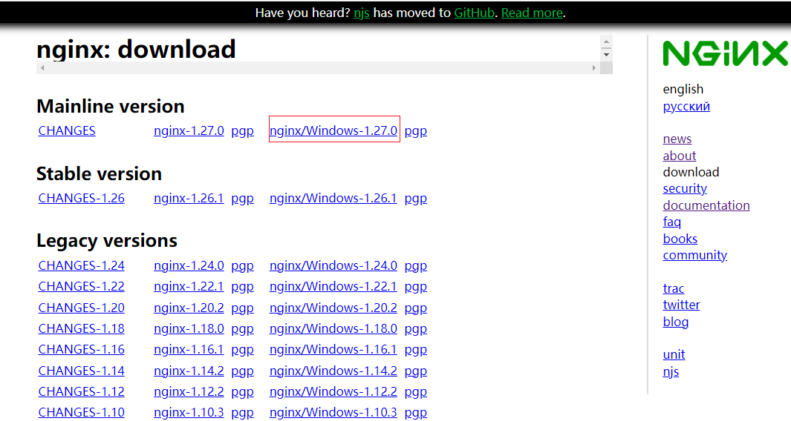
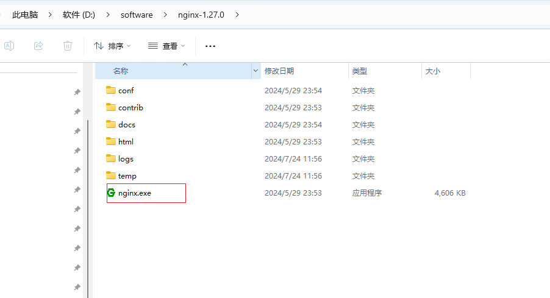

下面介绍 Nginx 的安装和基本配置步骤:

## 安装 Nginx

以 Ubuntu 为例,可以通过 apt 包管理器安装 Nginx:

```bash
sudo apt-get update
sudo apt-get install nginx
```

在 CentOS/RHEL 上可以使用 yum 包管理器安装:

```bash
sudo yum install epel-release
sudo yum install nginx
```

对于其他操作系统,可以从 [Nginx 官网下载](https://nginx.org/en/download.html)对应的安装包进行安装。



解压后运行 nginx.exe



## 启动和停止 Nginx

启动 Nginx 服务:

```bash
sudo systemctl start nginx
```


停止 Nginx 服务:

```bash
sudo systemctl stop nginx
```

重启 Nginx 服务:

```bash
sudo systemctl restart nginx
```
## 启动和停止 Nginx(window)

- 启动和重启 Nginx 服务:

```bash
nginx.exe
```  

检查 Nginx 服务是否已成功重启:

```bash
nginx.exe -t
```

如果输出显示 "nginx: the configuration file /path/to/nginx.conf syntax is ok" 和 "nginx: configuration file /path/to/nginx.conf test is successful"，则表示 Nginx 已成功重启。

停止 Nginx 服务:

```
nginx.exe -s stop
```

## 基本配置

Nginx 的主配置文件位于 /etc/nginx/nginx.conf。

常见的基本配置项包括:
   - listen: 指定 Nginx 监听的端口号,默认为 80 (HTTP)。
   - server_name: 指定服务器的域名或 IP 地址。
   - root: 指定网站的根目录位置。
   - index: 指定默认的索引文件,如 index.html。

示例配置:

```nginx
events {
    worker_connections 1024;
}

http {
    server {
        listen 80;
        server_name example.com;
        root /var/www/html;
        index index.html index.htm;
    }
}
```

## 测试配置并重载

检查配置文件是否有语法错误:

```bash
sudo nginx -t
```

重新加载配置文件而不中断服务:

```bash
sudo nginx -s reload
```

以上是 Nginx 的基本安装和配置步骤。根据实际需求,还可以进一步配置反向代理、负载均衡、SSL/TLS 等高级功能。更多详细配置信息可以参考 Nginx 的官方文档。
