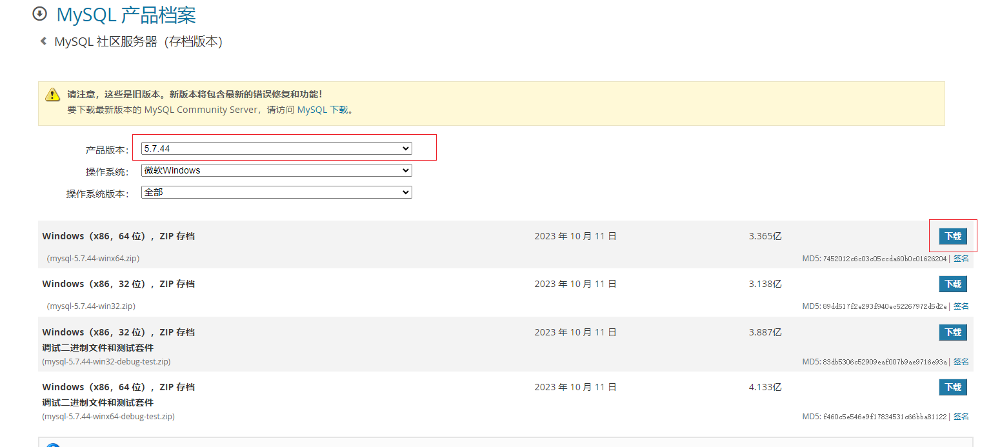
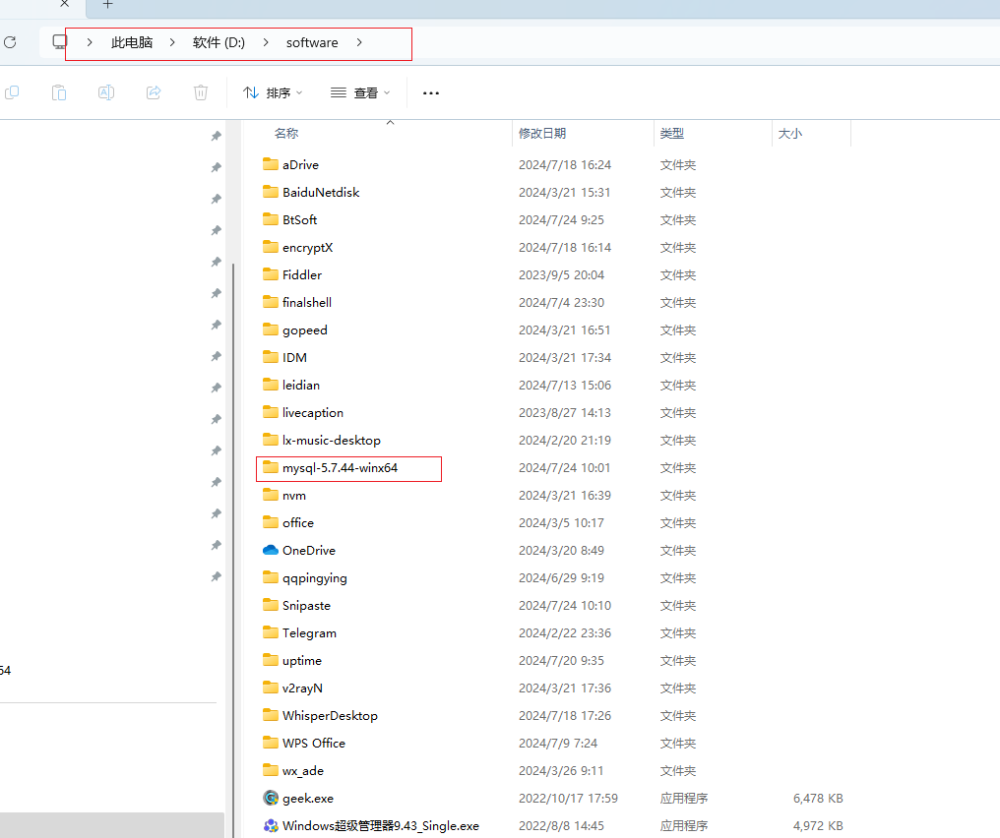
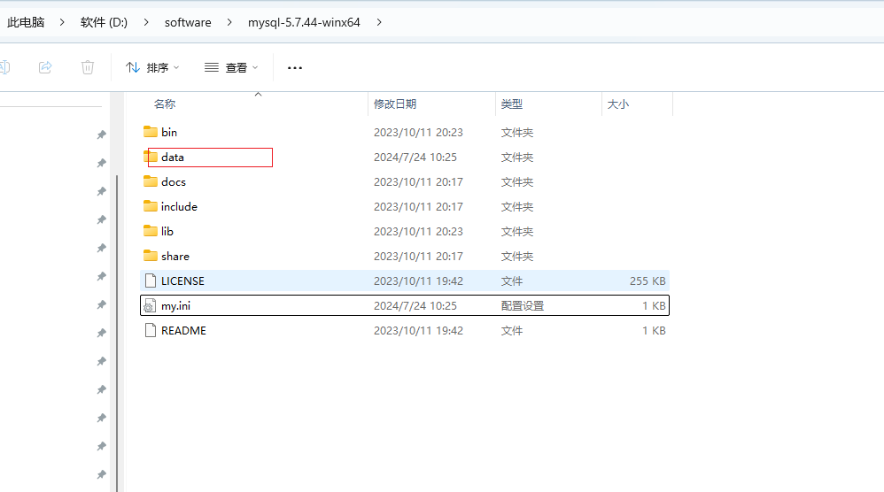
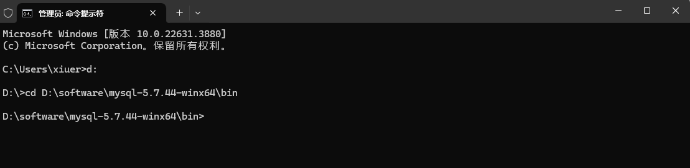
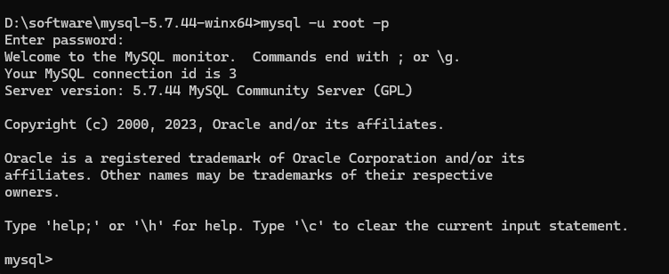

好的,让我来介绍一下 window 下 MySQL 的安装:

前往 [MySQL 官网](https://downloads.mysql.com/archives/community/) 下载对应版本 压缩包。



将压缩文件解压到你所需的安装目录上



在安装目录下创建 my.ini 配置文件，并录入配置信息  

```
[client]
default-character-set = utf8mb4

[mysqld]
port = 3306
max_connections = 100
character-set-server = utf8mb4
collation-server = utf8mb4_unicode_ci

[mysql]
default-character-set = utf8mb4
```

在安装目录下创建 data 文件夹用于存放进程数据



使用终端管理员进入安装目录下 bin 目录



使用如下命令初始化 MySQL 数据目录

```shell
mysqld --defaults-file="D:\software\mysql-5.7.44-winx64\my.ini" --initialize-insecure
```

使用如下命令将 MySQL 添加为 Windows 服务，服务名称可以自定义

```shell
mysqld --install "MySQL57"
```


启动刚刚创建的 MySQL 服务

```
net start MySQL57
```


连接 MySQL 检测是否启动成功

```shell
mysql -u root -p
```




这就是 MySQL 安装和基本配置的主要步骤。如果您在过程中遇到任何问题,欢迎随时向我咨询。我很乐意为您提供更多帮助。

