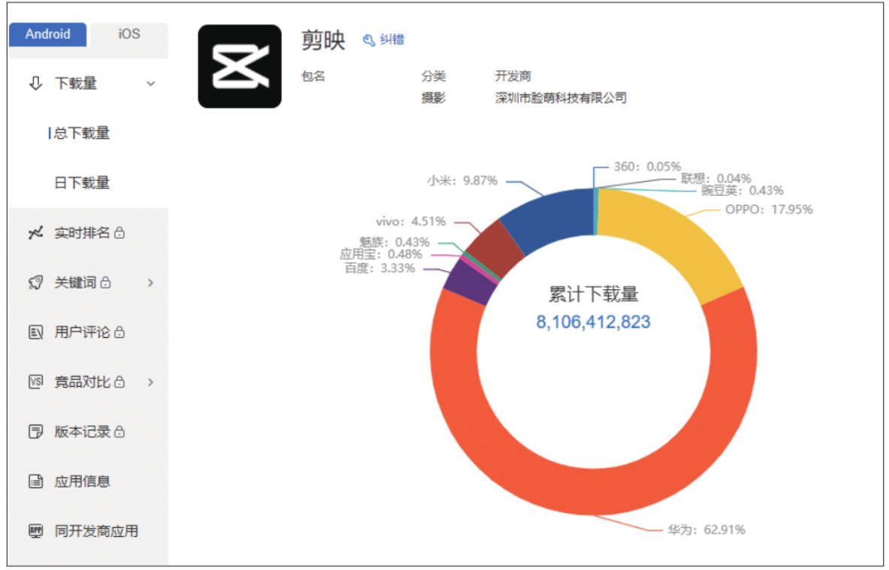

剪映是抖音官方于 2019 年 5 月推出的一款视频剪辑软件，带有全面的剪辑功能和丰富的曲库资源，拥有多样滤镜和美颜效果，一经上线便深受用户喜爱。据调查，截至 2023 年 3 月，剪映（Android 版）在各平台的总下载量高达 81.06 亿次，如图 1-1 所示。

以下是剪映的一些特色功能，之后的章节会对各项功能的具体操作进行详细讲解。

● 剪辑“黑科技”​：支持色度抠图、曲线变速、视频防抖、画面定格等高阶功能。

● 简单好用：切割、变速、倒放，功能简单易学。

● 素材丰富：资源丰富的素材库和素材包，精致好看的贴纸和字体。

● 海量曲库：抖音独家曲库，让视频更“声”动。

● 高级好看：专业风格滤镜，一键轻松美颜。

● 剪同款：快速出大片，简单实用，样式丰富。

● 免费教程：创作课堂提供海量免费课程，边学边剪，易上手。
