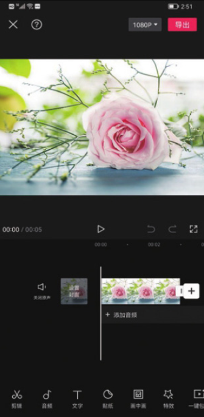
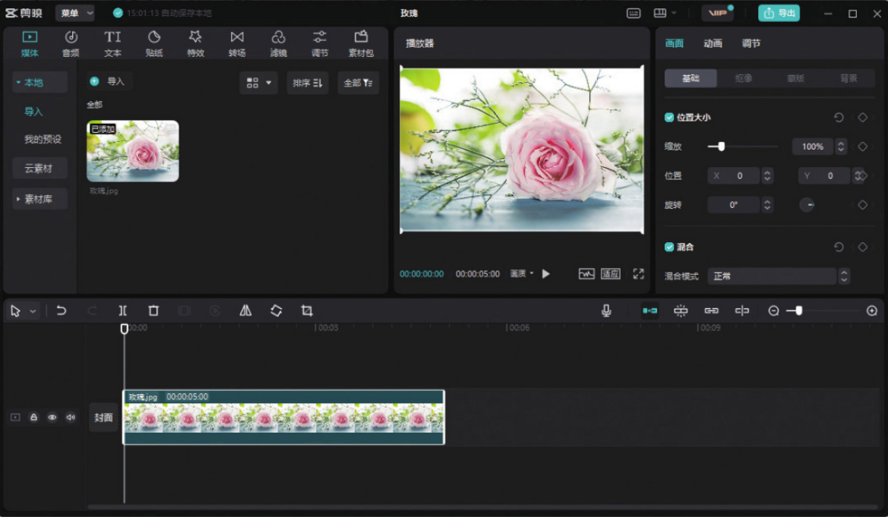

剪映专业版是抖音继剪映 App 之后，推出的在 PC 端使用的一款视频剪辑软件。剪映 App 与剪映专业版的最大区别在于两者适用的平台不同，因此界面的布局势必有所不同。

相比剪映 App，剪映专业版基于计算机屏幕的优势，可以为用户呈现更为直观、全面的画面编辑效果。图 1-2 和图 1-3 所示分别为剪映 App 和剪映专业版的工作界面。

剪映 App 的诞生时间较早，目前既有的功能和模块已趋于完善；而剪映专业版由于推出的时间不长，部分功能和模块还处于待完善状态。例如，剪映 App 中的“剪同款”和“创作课堂”功能，剪映专业版尚不具备。
