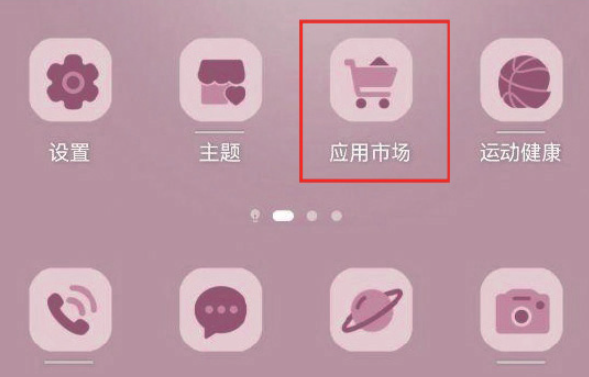
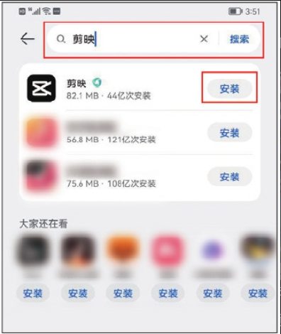
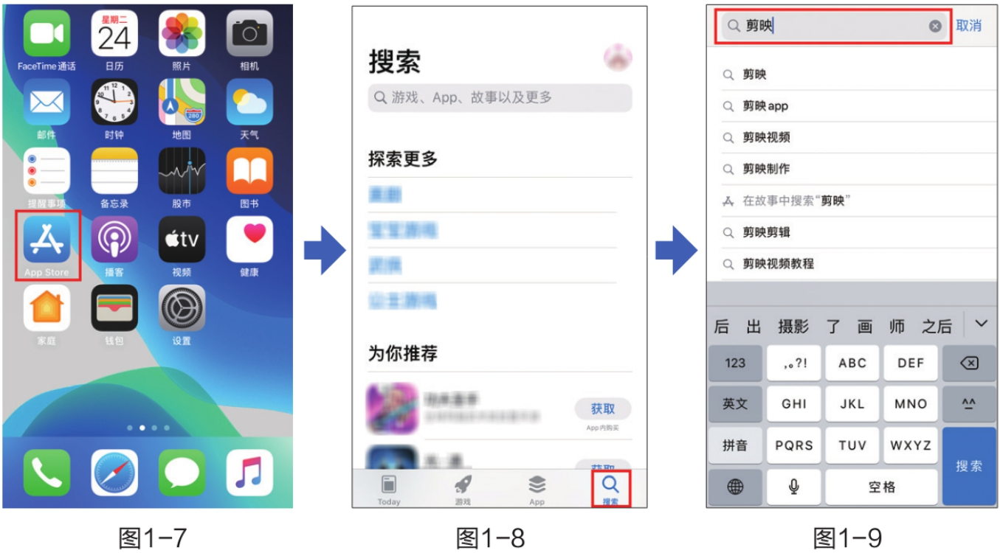
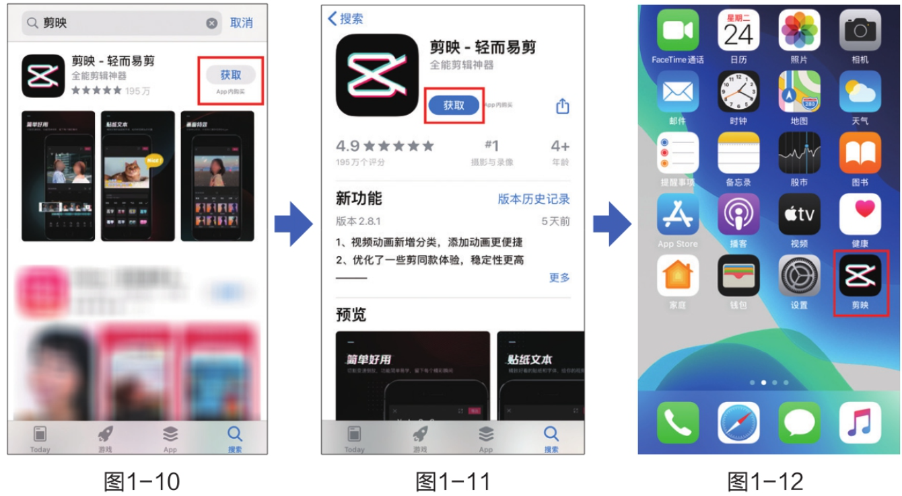
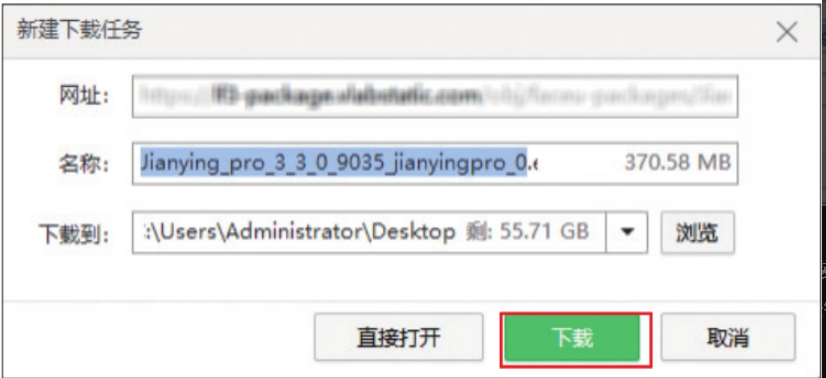
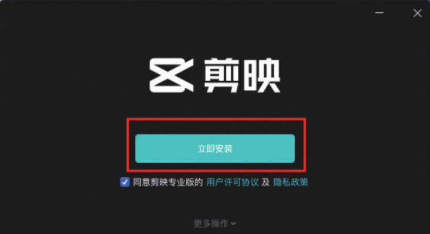
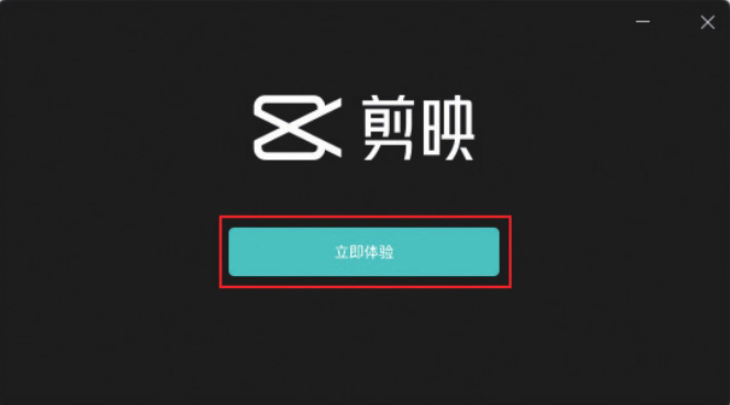

剪映 App 和剪映专业版下载与安装的方式不同。剪映 App 只需要在手机应用商店中搜索“剪映”并点击安装即可；而剪映专业版则需要在计算机浏览器中搜索“剪映专业版”​，进入官方网站后，在主页单击“立即下载”按钮进行安装。下面讲解具体的操作方法。

## 1. Android 系统手机

01 打开手机，在手机桌面点击“应用市场”​，如图 1-4 所示。



02 进入“应用市场”后，在搜索栏中输入“剪映”​，点击搜索出的应用旁边的“安装”按钮，即可完成剪映 App 的下载与安装，如图 1-5 和图 1-6 所示，安装完成后可以在手机桌面找到该应用。




```
手机应用的安装方法大同小异，不同系统的手机安装过程可能略有不同，上述安装方法仅供参考，请以实际操作为准。
```

## 2. iOS 系统手机

打开手机“App Store”​（应用商店）​，进入搜索界面，在搜索栏中输入“剪映”​，如图 1-7 至图 1-9 所示。



搜索到应用后，可直接点击应用旁边的“获取”按钮进行下载安装，也可以进入应用详情页，点击“获取”按钮进行下载安装，安装完成后可在桌面找到该应用，如图 1-10 至图 1-12 所示。



## 3. 下载并安装剪映专业版

01 在计算机浏览器中打开“百度”首页，在搜索框中输入关键词“剪映专业版”查找相关内容，如图 1-13 所示。

02 进入官方网站后，在主页上单击“立即下载”按钮，如图 1-14 所示。


03 单击该按钮后，浏览器将弹出任务下载框，用户可以自定义安装程序的下载位置，之后单击“下载”按钮进行下载即可，如图 1-15 所示。



04 完成上述操作后，在下载位置找到安装程序文件，双击程序文件，打开程序安装界面，单击“立即安装”按钮，即可开始安装剪映专业版，如图 1-16 所示。



05 安装完成后，单击“立即体验”按钮，即可启动剪映专业版软件，如图 1-17 所示。



```
上述操作是基于Windows版本剪映专业版编写的，若使用的版本不同，实际操作可能会存在差异，建议大家对照自身所使用的版本进行变通操作。
```
