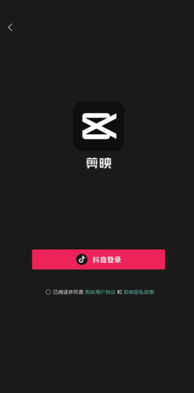
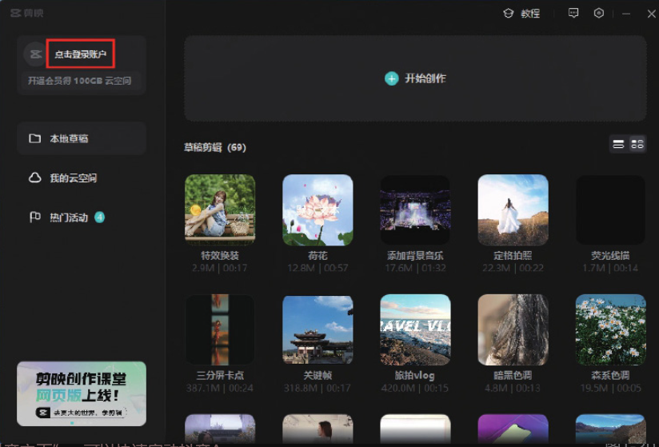
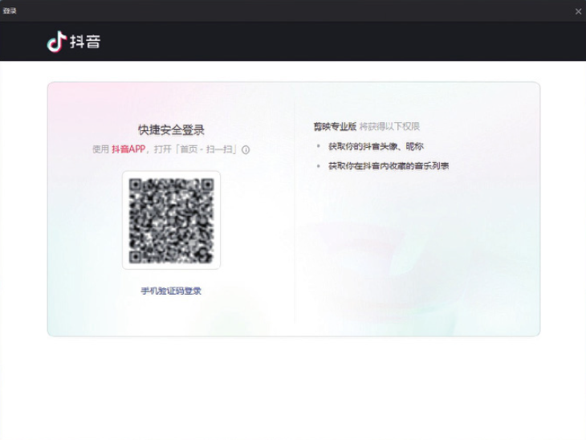

剪映作为抖音主打的视频剪辑软件，支持用户使用抖音账号登录，以实现剪映与抖音的无缝对接。下面将分别介绍使用抖音账号登录剪映 App 和剪映专业版的操作方法。

## 1. 使用抖音账号登录剪映 App

打开剪映 App，在主界面点击“我的”按钮，打开图 1-18 所示的账号登录界面，点击“抖音登录”按钮，在跳转的界面完成授权后，即可使用抖音账号登录剪映 App，如图 1-19 所示。




```
在图1-19所示的界面上点击“抖音主页”​，可以快速启动抖音App。
```

## 2. 使用抖音账号登录剪映专业版

在计算机桌面上双击“剪映”图标，启动剪映专业版软件，在打开的界面上单击“点击登录账户”按钮，进入登录界面，如图 1-20 和图 1-21 所示。




在手机上打开抖音 App，在首页点击“搜索”图标，再点击“扫一扫”图标，扫描图 1-21 所示界面上的二维码，进入抖音的授权界面，点击“同意授权”按钮，即可完成登录，如图 1-22 和图 1-23 所示。图 1-22


在实现剪映和抖音的账号互联之后，用户用剪映编辑视频时可以直接使用抖音 App 中收藏的歌曲，也可以将编辑好的视频分享至抖音。
