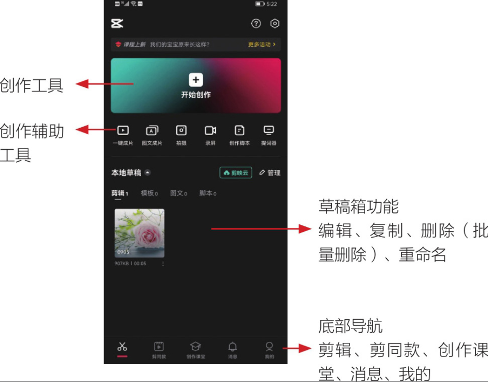

打开剪映 App，首先映入眼帘的是默认的剪辑界面，即剪映 App 的主界面，如图 1-24 所示。点击界面底部的“剪同款”、“创作课堂”、“消息”、“我的”按钮，可以切换至对应的功能界面，各功能界面的说明如下。

● 剪同款：包含各种各样的模板，用户可以根据菜单分类选择模板进行套用，也可以通过搜索框搜索自己想要的模板进行套用。

● 创作课堂：包含抖音的各种视频剪辑教程及热门玩法。

● 消息：接收官方的通知及消息、粉丝的评论及点赞提示等。

● 我的：展示个人资料情况及收藏的模板。
