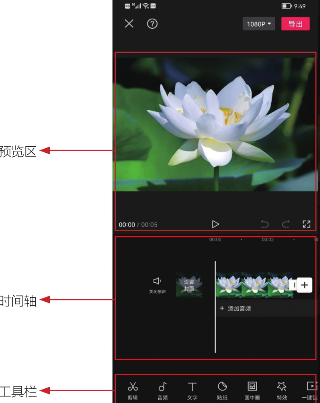
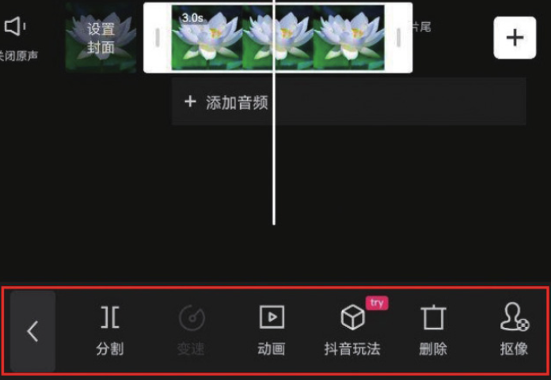
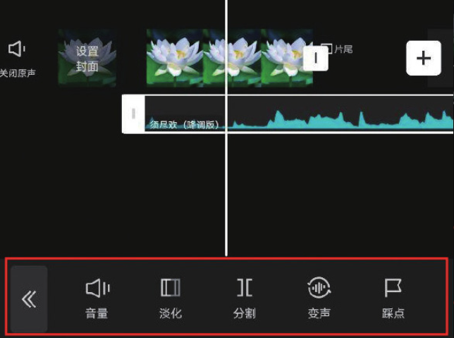

在主界面点击“开始创作”按钮，进入素材添加界面，在选择相应素材并点击“添加”按钮后，即可进入视频编辑界面，如图 1-25 所示。该界面由三部分组成，分别为预览区、时间轴和工具栏。

## 1. 预览区

预览区的作用在于实时查看视频画面，它始终显示当前时间线所在那一帧的画面。可以说，视频剪辑过程中的任何一个操作，都需要在预览区确认其效果。当对完整视频进行预览后，发现已经没有必要继续修改时，一个视频的后期剪辑就完成了。

在图 1-25 中，预览区左下角显示的 00:00/00:05，表示当前时间线所在时间刻度为 00:00，00:05 则表示视频总时长为 5s。

点击预览区底部的播放图标，即可从当前时间线所处位置开始播放视频；点击撤回图标，即可撤回上一步的操作；点击恢复图标，即可在撤回操作后再将其恢复；点击全屏图标可全屏预览视频。

## 2. 时间轴

在使用剪映进行视频后期剪辑时，90%以上的操作是在时间轴中完成的，该区域包含三大元素，分别是轨道、时间线和时间刻度。当需要对素材长度进行裁剪或者添加某种效果时，就需要同时运用这三大元素来精准控制裁剪和添加效果的范围。

## 3. 工具栏

剪映编辑界面的底部为工具栏，剪映中几乎所有的功能都能在工具栏中找到相关选项，在不选中任何轨道的情况下，显示的为一级工具栏；点击相应按钮，即可进入二级工具栏。

需要注意的是，当选中某一轨道后，剪映工具栏会随之发生变化——变成与所选轨道相匹配的工具。图 1-26 所示为选中图像轨道时的工具栏，图 1-27 所示为选中音频轨道时的工具栏。

