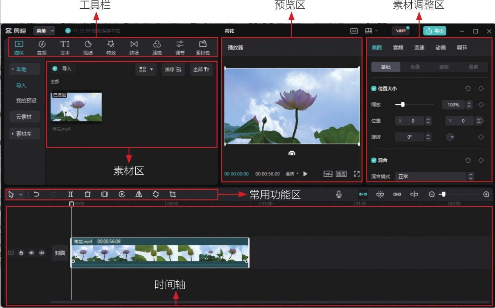
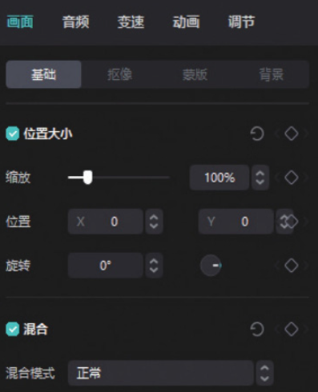
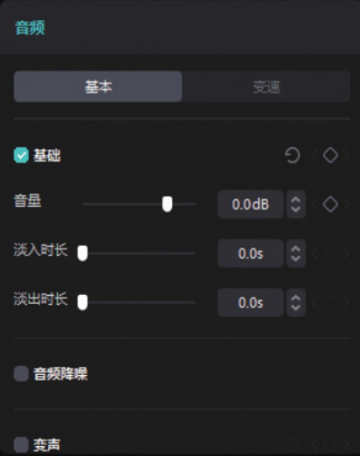
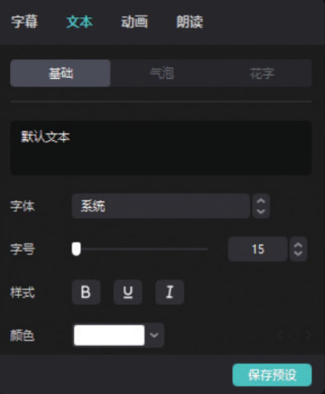

在计算机桌面上双击“剪映”图标，单击“开始创作”按钮，即可进入剪映专业版的编辑界面。剪映专业版的整体操作逻辑与剪映 App 几乎是一致的，但由于计算机显示器的屏幕较大，操作界面会有一定的区别。因此，只要了解各个功能、选项的位置，在学会了剪映 App 的操作方法以后，就自然知道如何使用剪映专业版进行剪辑了。

剪映专业版界面如图 1-28 所示，主要包含六大区域，分别为工具栏、素材区、预览区、素材调整区、常用功能区和时间轴。六大区域分布着剪映专业版的所有功能和选项。其中占据空间最大的是时间轴，该区域也是视频剪辑的主战场。剪辑的绝大部分工作都会对时间轴中的轨道进行编辑，以实现预期的视频效果。



剪映专业版各区域功能介绍如下。

● 工具栏：工具栏中包含“媒体”​“音频”​“文本”​“贴纸”​“特效”​“转场”​“滤镜”​“调节”​“素材包”9 个选项。其中只有“媒体”选项没有在剪映 App 中出现。在剪映专业版中选择“媒体”选项后，可以从“本地”或者“素材库”中选择素材并将其导入素材区。

● 素材区：选择工具栏中的“贴纸”​“特效”​“转场”等选项，其可用素材、效果均会在素材区显示出来。

● 预览区：在后期剪辑过程中，可随时在预览区查看效果，单击预览区右下角的按钮，可进行全屏预览；单击右下角的按钮，可以调整画面比例。

● 素材调整区：选中时间轴中的某一轨道后，素材调整区会出现该轨道的效果设置参数。选中视频轨道、音频轨道、文字轨道时，素材调整区分别如图 1-29 至图 1-31 所示。




● 常用功能区：在常用功能区，可以快速对视频进行分割、删除、定格、倒放、镜像、旋转和裁剪 7 种操作。另外，如果操作失误，单击撤回按钮，即可将这一步操作撤销；单击按钮，即可将鼠标的作用设置为“选择”或者“分割”​。选择“分割”选项后，在视频轨道上单击，即可在当前位置分割视频。

● 时间轴：时间轴中包含三大元素，分别为轨道、时间线、时间刻度。由于剪映专业版的界面较大，所以不同的轨道可以同时显示在时间轴中，如图 1-32 所示，相比剪映 App，这种优势可以提高后期处理的效率。

```
在使用剪映App时，由于图片和视频都是从“相册”中找到的，所以“相册”就相当于剪映的素材区。但对于剪映专业版而言，因为计算机中没有一个固定的、用于存储所有图片和视频的文件夹，所以会有单独的素材区。使用剪映专业版进行后期处理的第一步，就是将准备好的一系列素材全部添加到素材区，在后期处理过程中，需要哪个素材，就将哪个素材从素材区拖至时间轴中即可。
```
