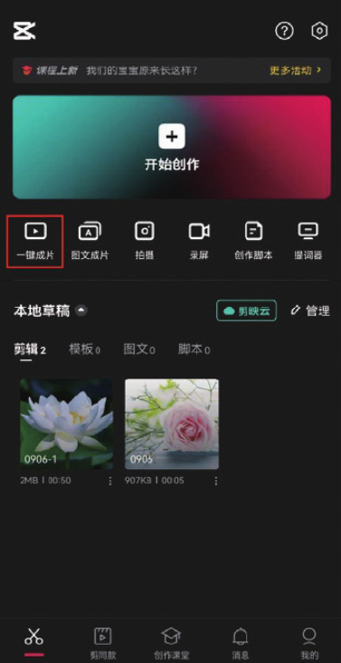
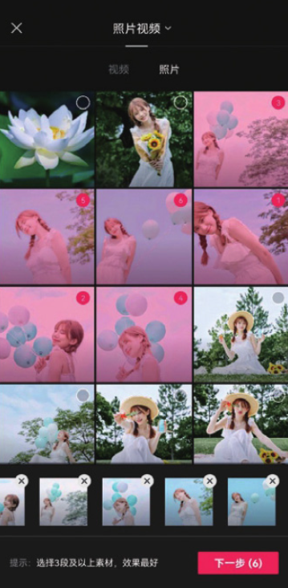

剪映的“一键成片”功能根据用户选择的视频或图像素材，推荐视频模板，随机生成视频。其操作方法非常简单，打开剪映 App 之后，在主界面点击“一键成片”按钮，即可进入素材选取界面，如图 1-33 和图 1-34 所示。

在素材选取界面选择完需要使用的素材后，点击“下一步”按钮，系统会自动将所选素材合成视频，如图 1-35 和图 1-36 所示。

系统会为生成的短视频内容自动添加背景音乐及转场特效，用户如果对视频效果不满意，可以点击替换为别的视频模板，或者在页面下方点击“立即编辑”按钮，对视频内容进行简单的编辑和修改。
