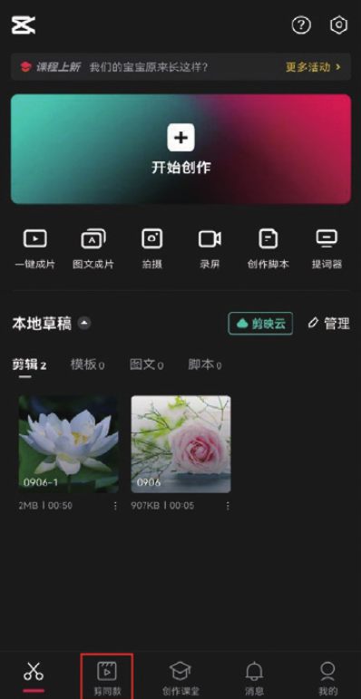
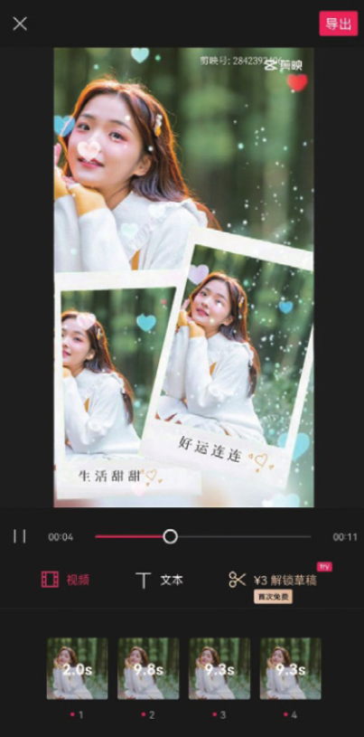
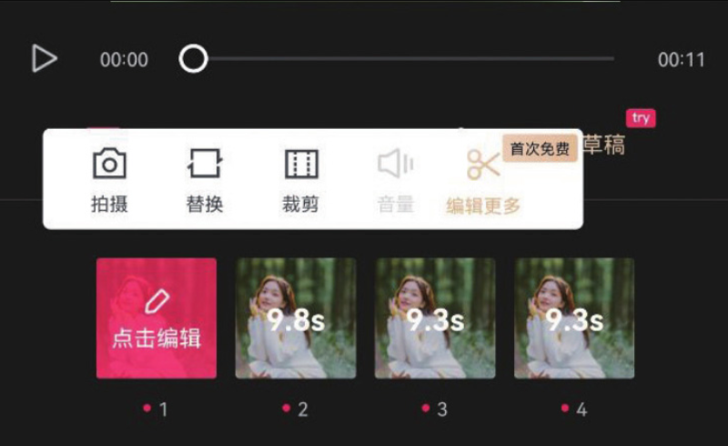
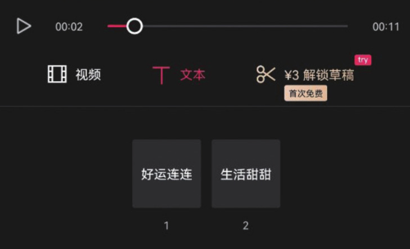

“剪同款”是剪映的一项特色功能，它为用户提供了大量视频创作模板，用户只需手动添加视频或图像素材，就能够直接将他人编辑好的视频参数套用到自己的视频中，快速且高效地制作出一条包含特效、转场、卡点等效果的完整视频。

打开剪映 App，在主界面点击“剪同款”按钮，即可跳转至模板界面，如图 1-37 和图 1-38 所示。

在模板界面挑选一个需要应用的模板后，直接点击该模板，进入模板视频的播放界面，点击界面右下角的“剪同款”按钮，即可进入素材选取界面，如图 1-39 和图 1-40 所示。

素材选取界面底部会提示用户需要选择几段素材，以及视频素材或图像素材所需的时长。在完成素材选择后，点击“下一步”按钮，等待片刻即可生成相应的视频内容，如图 1-41 和图 1-42 所示。

系统会为生成的短视频内容自动添加模板视频中的文字、特效及背景音乐，用户可以在编辑界面对视频效果进行预览，或者对内容进行简单的编辑和修改。

编辑界面下方分别提供了“视频”和“文本”两个选项，选择“视频”选项，点击素材缩览图，将弹出“点击编辑”按钮，点击该按钮，页面将弹出“拍摄”​“替换”​“裁剪”等选项，如图 1-43 所示，用户可以根据自己的需求对素材进行相应的调整。

切换至“文本”选项，可以看到底部分布的文字缩览图，如图 1-44 所示，点击文字缩览图，即可将该段文字修改为新的文字内容。

