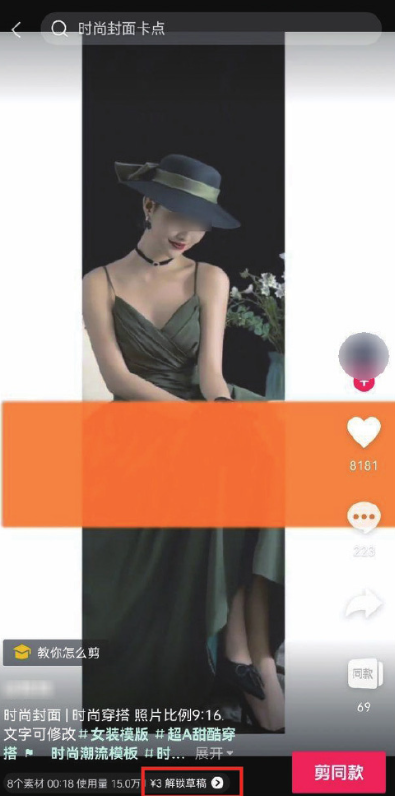
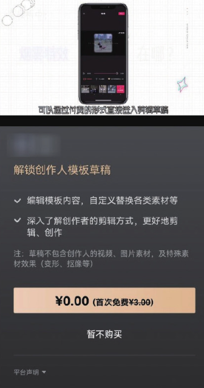

很多用户都非常喜欢使用剪映的模板来创作短视频，但对模板的相关知识一知半解，下面汇总了一些关于模板的常见问题，并对其做出了详细的解答，以帮助读者更好地使用剪映模板。

## 1. 什么是视频模板

视频模板就是创作人在剪映中制作出的共享给用户使用的视频源文件。用户点击“剪同款”界面的模板，就可以使用创作人精心设计的创作效果，包括贴纸、转场、动画、文字、滤镜等。

## 2. 模板分栏有哪些

目前剪映的模板分栏包含关注、推荐、卡点、日常碎片、萌娃、情感、玩法、纪念日、情侣、美食、旅行、风格大片、友友天地、Vlog、萌宠、动漫、游戏。

其中“关注”栏展示的是用户所关注的模板创作人制作的模板，以便用户能实时了解所喜欢的创作人是否更新了模板。而“推荐”栏所展示的是根据用户的喜好筛选出的内容和近期平台大部分用户都喜欢看的内容。

其他分类均为不同领域的分栏，用户可以根据自己的喜好进行选择。

## 3. 什么是付费模板

模板播放界面、模板编辑界面上标有售价的模板均为付费模板，用户可通过付费进一步查看模板原始的制作草稿。

如果用户需要购买付费模板，可以在模板播放界面的底部点击“解锁草稿”​，进入购买流程，如图 1-45 和图 1-46 所示。付费后可解锁该模板的原始剪辑草稿，编辑模板中的音乐、特效、贴纸等内容，从而创作出更有趣的视频。但用户所购买的模板草稿中，不包含模板的视频和图片素材、特殊素材效果（如变形、抠图等）​。

需要注意的是，如果模板购买界面没有标明“模板商业授权，线上线下全场景可用”​，则购买的付费模板不能用于制作商业视频，用户需要仔细甄别。

## 4. 如何成为模板创作人

成为模板创作人主要有两个途径。一是参加剪映不定期的招募活动，详见 App 内的活动宣传，如剪映创作人招募大赛，用户可以直接点击进去查看和申请；二是剪映会根据用户在剪映中进行视频制作时的导出次数、剪映活跃天数、抖音平台的创作领域、粉丝数等维度，不定期邀请少量用户加入。

## 5. 成为模板创作人有什么好处

模板创作人可以获得剪映模板创作权限，发布模板到“剪同款”​，通过模板获得一定的收益，还可以获得剪映红 V、创作人领域等官方认证，享受身份荣誉。
