本案例介绍的是萌娃汉服写真短视频的制作方法，主要使用剪映的“一键成片”功能。下面介绍具体的操作方法。

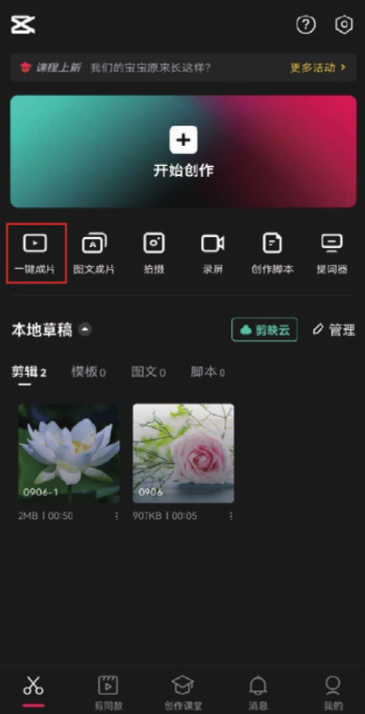
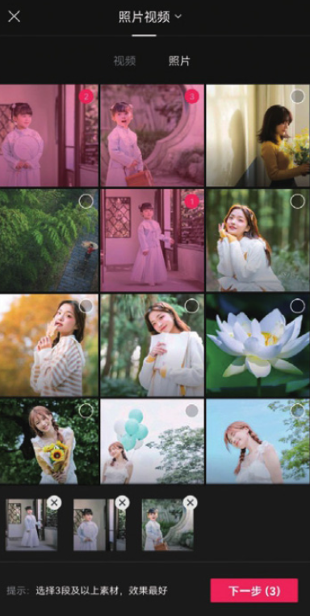

02 进入模板选取界面，滑动界面下方的模板选项栏，点击需要应用的视频模板，再点击模板缩览图中的“点击编辑”按钮，如图 1-49 和图 1-50 所示。

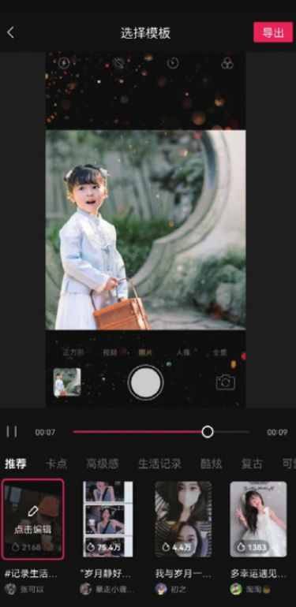
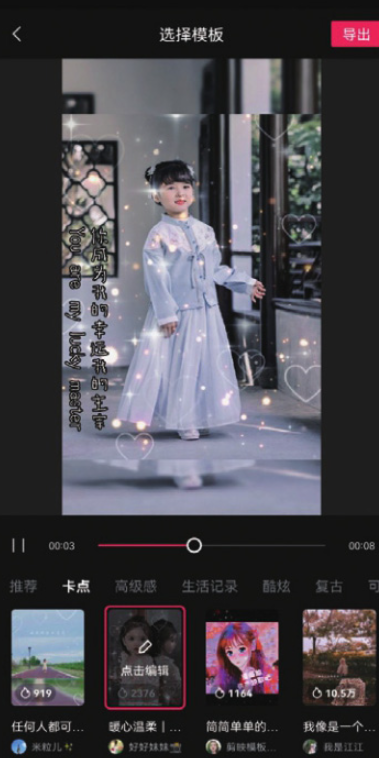

03 进入视频编辑界面，点击素材缩览图中的“点击编辑”按钮，再在界面浮现的工具栏中点击“裁剪”按钮，如图 1-51 所示，在裁剪界面拖动裁剪框选取视频的显示区域，操作完成后点击界面右下角的“确认”按钮，如图 1-52 所示。

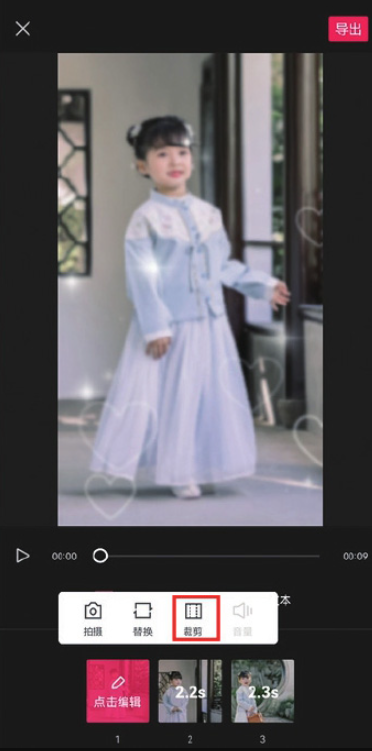

04 按照步骤 03 的操作方式裁剪好余下的两段素材后，切换至“文本”选项，点击界面底部的文字素材缩览图，再点击缩览图中的“点击编辑”按钮，如图 1-53 和图 1-54 所示，系统弹出输入键盘，将选中的文字内容修改为需要输入的文案，如图 1-55 所示。

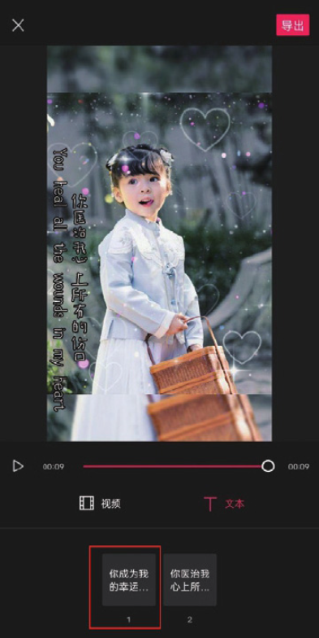
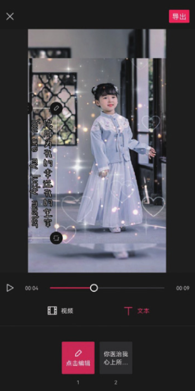

05 按照步骤 04 的操作方式修改好第 2 句文案后，点击界面右上角的“导出”按钮进入导出设置界面，点击“无水印保存并分享”按钮，如图 1-56 和图 1-57 所示。

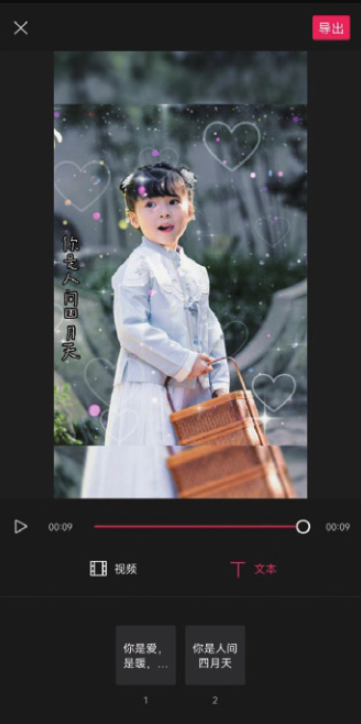
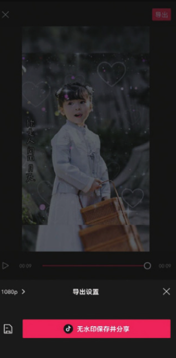

制作出的萌娃汉服写真短视频效果如图 1-58 和图 1-59 所示。

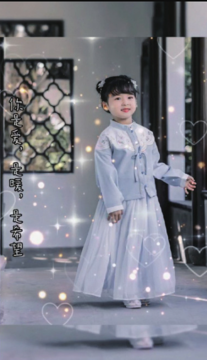
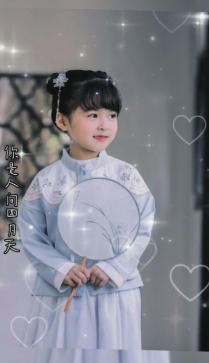

```
导出设置界面的底部有两个选项，当用户点击按钮后，制作好的视频会自动保存至手机相册，通过这种方式保存的视频会带有“剪映”的水印；而当用户点击“无水印保存并分享”按钮后，视频会自动保存至手机相册并跳转至抖音的发布界面。
```
