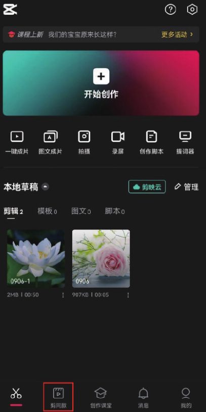
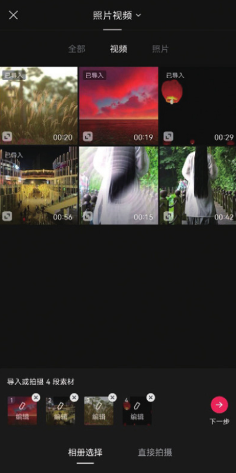
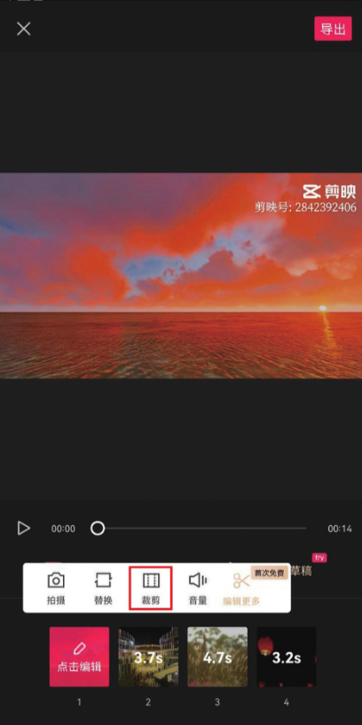

本案例介绍的是节日祝福短视频的制作方法，主要使用剪映的“剪同款”功能。下面介绍具体的操作方法。

01 打开剪映 App，在主界面点击“剪同款”按钮，跳转至模板界面，如图 1-60 所示，在界面顶部的搜索栏中输入“节日祝福视频模板”进行搜索，找到该类型的短视频模板，如图 1-61 和图 1-62 所示。

02 点击需要应用的视频模板进入播放界面，再点击界面右下角的“剪同款”按钮，如图 1-63 所示，进入素材选取界面，选好需要使用的素材，点击“下一步”按钮，如图 1-64 所示。

03 进入视频编辑界面，点击素材缩览图中的“点击编辑”按钮，再在界面浮现的工具栏中点击“裁剪”按钮，如图 1-65 和图 1-66 所示，在裁剪界面拖动裁剪框选取需要显示的视频片段，操作完成后点击界面右下角的“确认”按钮，如图 1-67 所示。

04 点击页面右上角的“导出”按钮，将视频保存至相册，效果如图 1-68 和图 1-69 所示。

