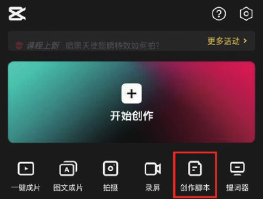

剪映的“创作脚本”功能为用户提供了很多优质用户上传的脚本，用户可以选择自己需要使用的脚本，然后根据脚本上面的相关提示，上传视频素材和文案。

打开剪映 App，在主界面点击“创作脚本”按钮，如图 1-70 所示。

系统跳转至“创作脚本”界面，如图 1-71 所示，选择需要的分类和自己喜欢的视频脚本，切换到脚本的详情介绍界面，如图 1-72 所示，里面详细分析了该视频的脚本结构和创作思路，点击“去使用这个脚本”按钮，系统将自动提取该视频的脚本，点击该界面上的“添加”按钮进行脚本的添加，如图 1-73 所示。

打开手机相册，如图 1-74 所示，点击需要使用的素材缩览图，进入视频裁剪界面，拖动裁剪框，选取需要显示的视频片段，点击“确定”按钮后继续点击“添加”按钮，可以进行脚本的添加，如图 1-75 和图 1-76 所示。

按照脚本中的提示和上述操作方法添加余下的视频素材，输入相关文案后，点击界面右上角的“导入剪辑”按钮，进入视频编辑界面，为视频添加一首合适的背景音乐，如图 1-77 和图 1-78 所示。点击“导出”按钮，将仿制好的视频保存至手机相册。

