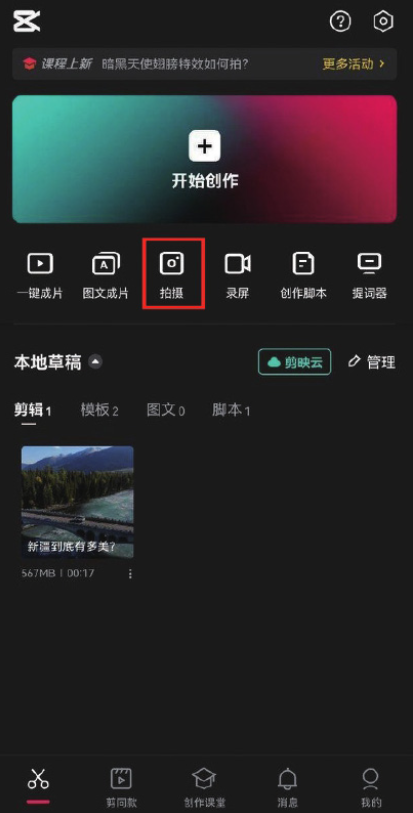
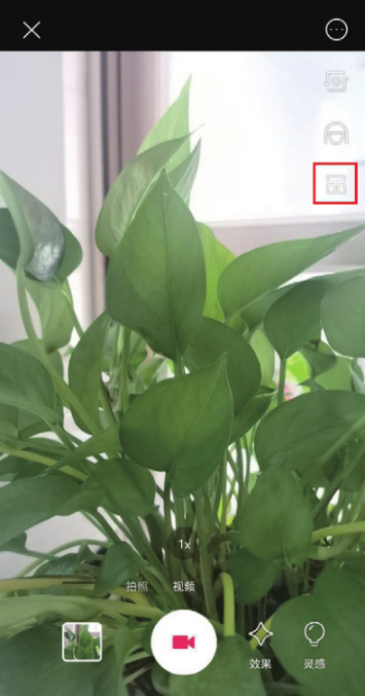
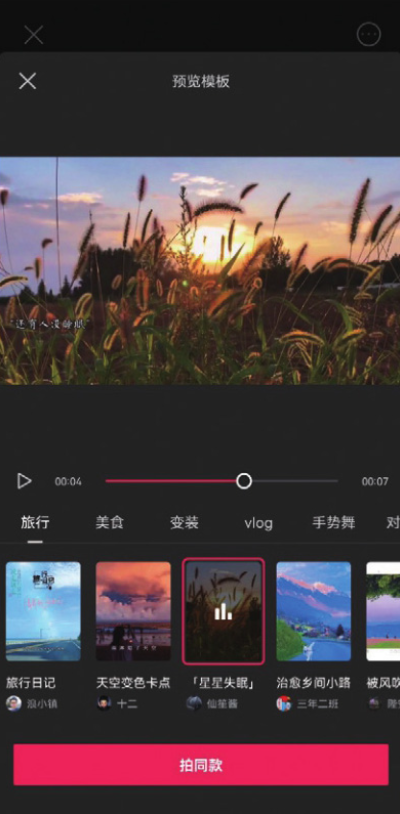
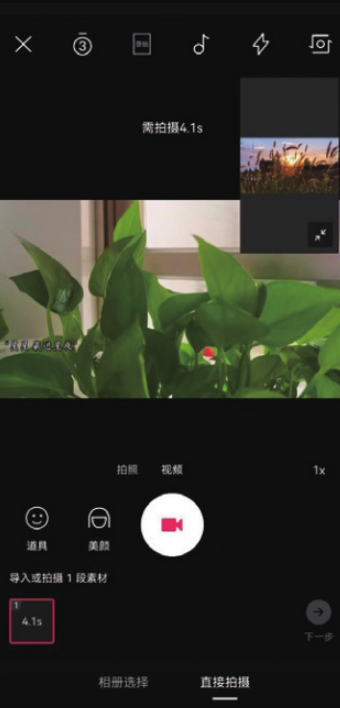
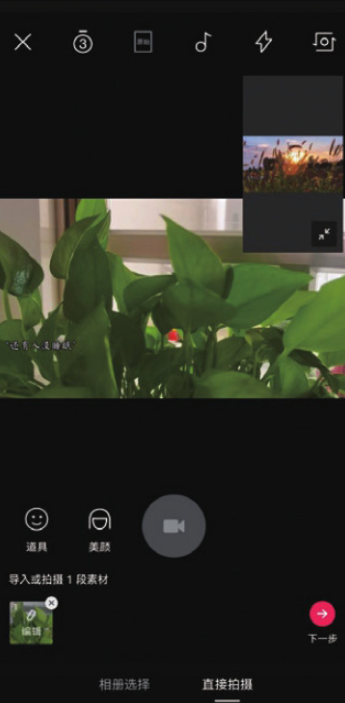
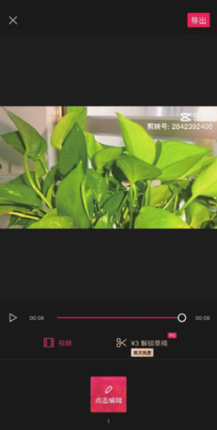

使用“模板跟拍”功能首先需要进入剪映的拍摄界面，然后打开模板选取界面，选择一款合适的模板进行拍摄。下面介绍具体的操作方法。

打开剪映 App，在主界面点击“拍摄”按钮，如图 1-79 所示，进入拍摄界面，点击界面右侧的“模板”按钮，进入模板选取界面，选择需要的分类和自己喜欢的模板视频，然后点击“拍同款”按钮，如图 1-80 和图 1-81 所示。

进入素材拍摄界面，点击“拍摄”按钮，仿照模板视频的画面拍摄视频素材，如图 1-82 所示。拍摄完成后，点击“确认并继续拍摄”按钮，如图 1-83 所示。

系统将自动为视频素材添加模板视频中的特效、音乐和字幕，如图 1-84 所示，点击“下一步”按钮，系统跳转至编辑界面，预览视频效果，确认无误后，即可点击“导出”按钮，将仿制好的视频保存至相册，如图 1-85 所示。

