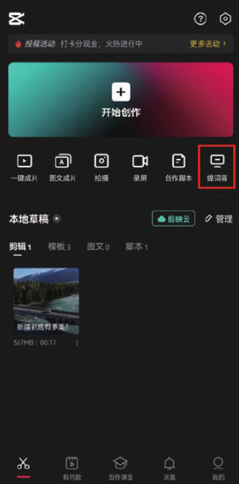
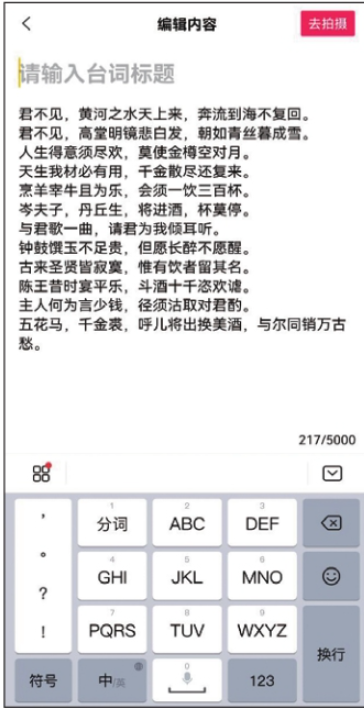
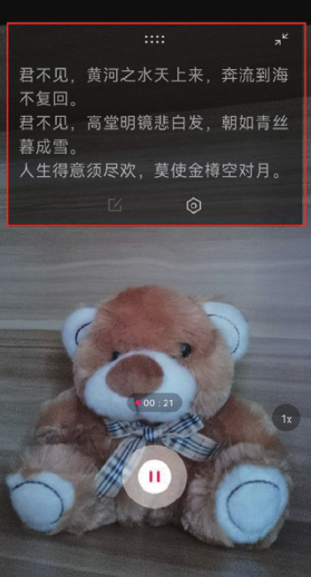
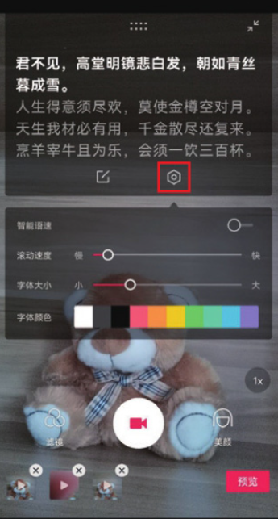

剪映的“提词器”功能是短视频创作者经常使用的一项功能，尤其是在制作口播类视频的时候，它可以帮助创作者实现脱稿录制，从而节省背诵文案的时间。

使用“提词器”功能的方法非常简单：打开剪映 App，在主界面点击“提词器”按钮，如图 1-86 所示，进入文案编辑界面，输入需要提示的文案内容后，点击界面右上角的“去拍摄”按钮，如图 1-87 所示。

进入拍摄界面，输入的文案会在界面上方以滚动的形式播放，如图 1-88 所示，用户在录制视频时可以根据上方的提示朗诵文案，而录制完成的视频中不会出现文本内容；当用户点击界面上的“设置”按钮时，下方会浮现出一个“智能语速”弹窗，里面有“滚动速度”​“字体大小”​“字体颜色”三个选项，用户可以根据自己的需求进行设置，如图 1-89 所示。

