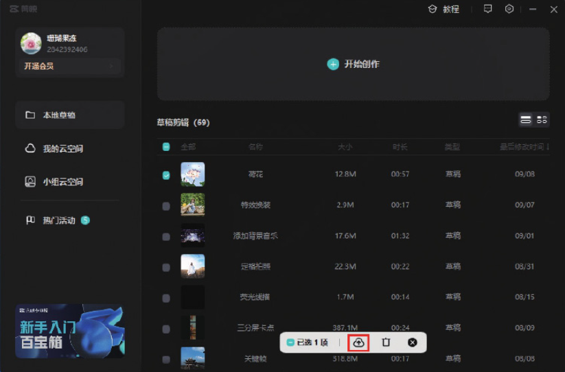
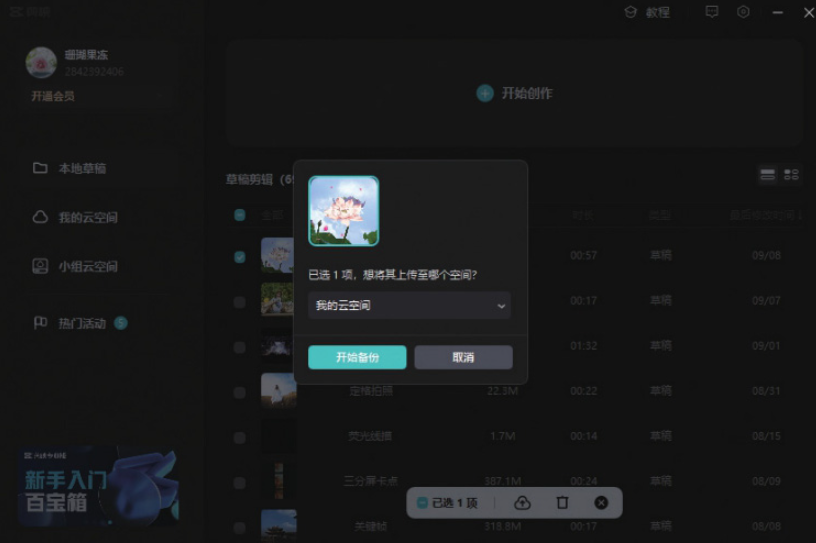
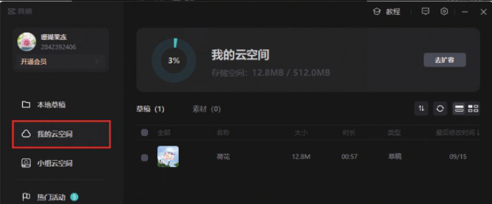
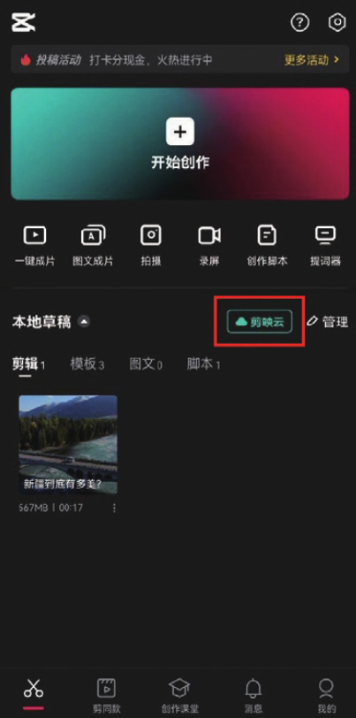
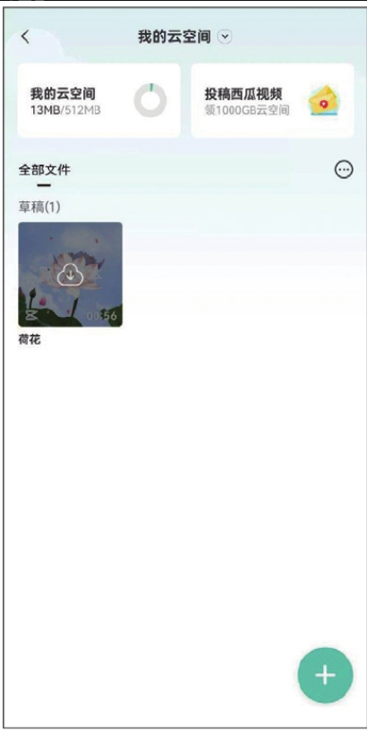
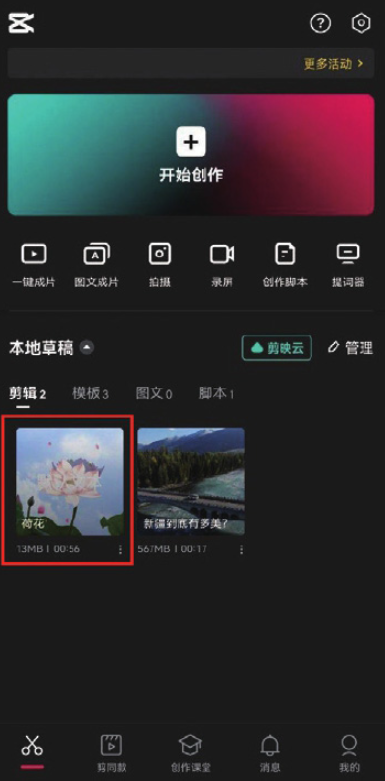
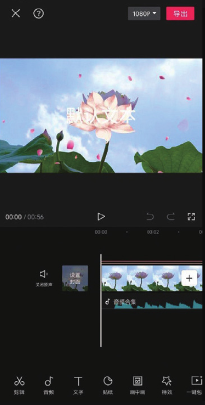

在用剪映编辑视频时，系统会自动将剪辑好的视频保存至草稿箱，可是草稿箱中的内容一旦删除就找不到了，为了避免这种情况发生，用户可以将重要的视频发布到云空间，这样不仅可以将视频备份存储，还可以实现多设备同步编辑。

01 启动剪映专业版软件，登录抖音账号，在草稿箱中勾选需要进行备份的视频，单击“上传”按钮，如图 1-90 所示。

02 在界面弹出的对话框中单击“开始备份”按钮，如图 1-91 所示。

03 将视频备份至云端后，单击“我的云空间”可以查看存储的视频项目，如图 1-92 所示。

04 在手机上打开剪映 App，登录同一个剪映账号，在主界面点击“剪映云”按钮，如图 1-93 所示，进入“我的云空间”界面，可以看到之前备份的视频项目，如图 1-94 所示。

05 点击视频缩览图中的“下载”按钮，将视频下载至本地，在界面弹出的对话框中点击“前往编辑”按钮，如图 1-95 所示。

06 跳转至主界面后，可以看到该视频项目已下载至“本地草稿”​，如图 1-96 所示。点击视频缩览图，即可打开视频编辑界面，在手机端继续进行后期编辑，如图 1-97 所示。

