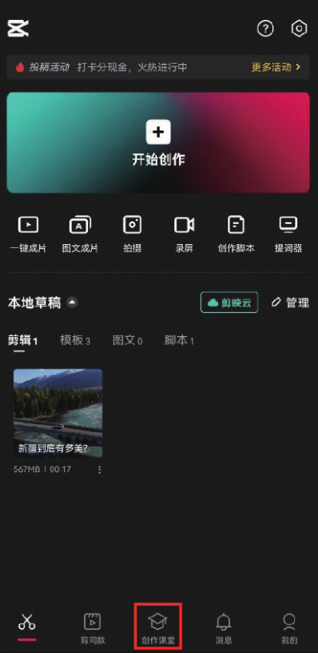

“创作课堂”是剪映专门建立的“学习中心”​，里面包括很多剪辑技巧课程，如“关键帧”​“调色”​“转场”​“特效”等。很多讲师还会以直播的形式讲授剪辑技巧，对于刚入门的新手而言非常有帮助，直播过程中还经常会有活动，这是剪映官方对短视频创作者的一种回馈和鼓励。

用户只需要打开剪映 App，点击界面底部的“创作课堂”图标，即可找到海量后期技巧教学资源，如图 1-102 和图 1-103 所示。




```
创作课堂中有免费课程，也有付费课程，付费课程需要购买后才能进行学习。
```
