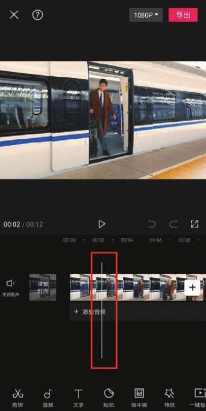
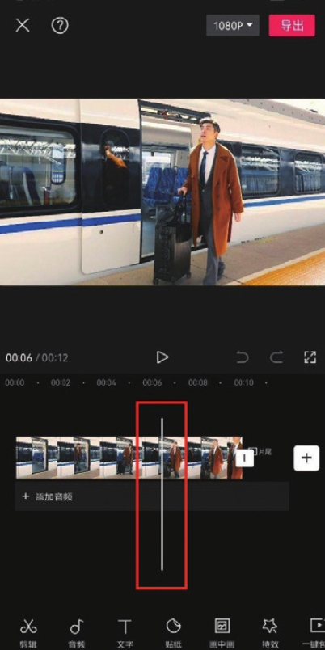

当从一个镜头中截取视频片段时，只需要在移动时间线的同时观察预览画面，通过画面内容来确定截取视频的开头和结尾。以图 2-1 和图 2-2 为例，利用时间线可以精准定位视频中人物从列车上走下的画面，从而确定截取的开头和结尾。

利用时间线定位视频画面几乎是所有后期剪辑中的必需操作。因为无论对哪一种后期效果来说，都需要确定其“覆盖范围”​，而“覆盖范围”其实就是利用时间线来确定画面的起始时刻和结束时刻。
