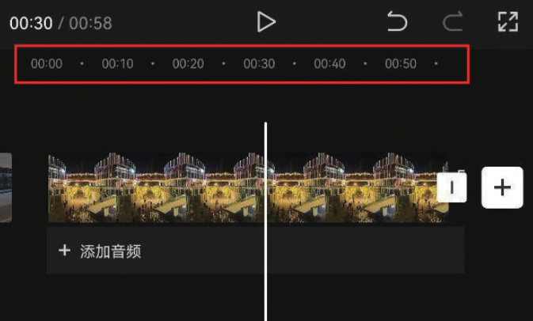
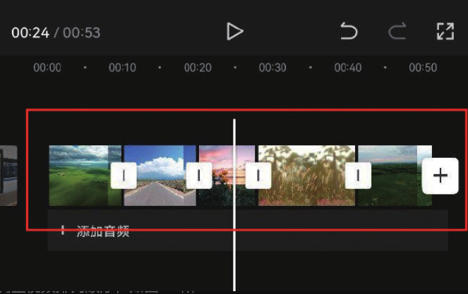

在处理长视频时，由于时间跨度比较大，因此时间线从视频开头移动到视频结尾需要较长的时间。

遇到这种情况时，可以将视频轨道“缩短”​（两个手指在屏幕上捏合）​，这样时间线移动较短距离，就能实现视频时间刻度的大范围跳转。

例如，在图 2-3 中，由于每一格的时间跨度为 5 秒，因此对于这个 58 秒的视频来说，将时间线从开头移动到结尾可以在极短的时间内完成。

另外，当轨道中有多个素材时，将时间轨道缩短后，每一段素材在界面上显示的“长度”也会变短，这样更便于调整视频排列顺序，如图 2-4 所示。

