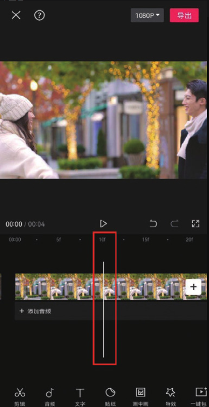
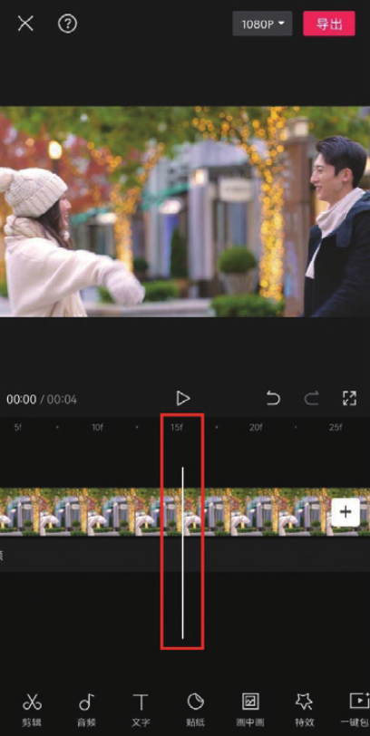

动态视频其实就是快速连续播放多个静态画面来呈现的效果，而视频的每个静态画面被称为“帧”​。

在剪映 App 的时间轴中，将时间轴拉长到一定程度（两个手指在屏幕上分开）后，时间刻度将会以帧为单位显示。

手机录制视频的帧率一般为 30 帧/秒，也就是每秒连续录制 30 个画面。所以，当将视频轨道拉至最长时，每一帧画面都会显示出来，这样可以极大地提高画面选择的精准度。

例如，图 2-5 所示的画面和图 2-6 所示的画面就存在细微差别，人物之间的距离、人物的位置及女孩手臂张开的幅度都有变化。在拉长轨道后，可以利用时间线从这细微的变化中进行画面的选取。

