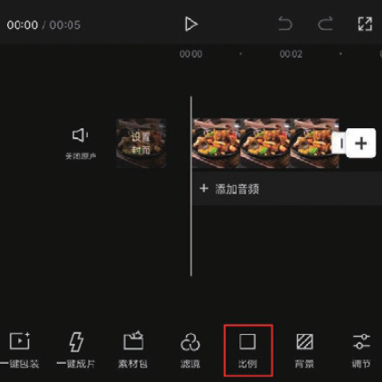
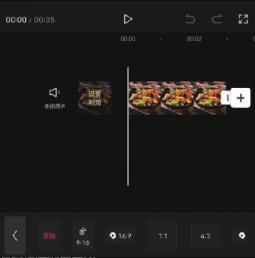
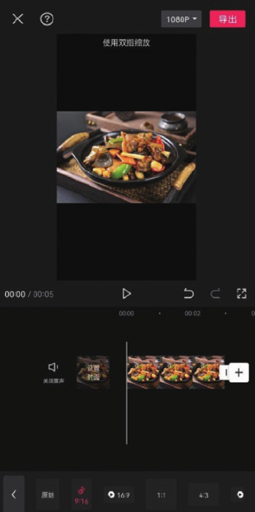
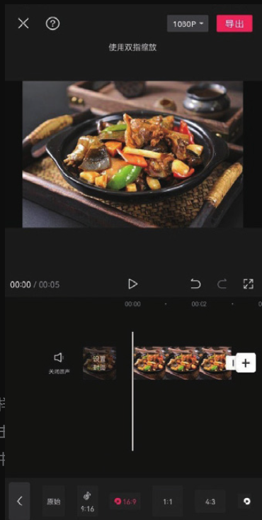

剪映 App 为用户提供了多种画幅比例，用户可以根据自身的视觉习惯和画面内容进行选择。在未选中任何素材的状态下，点击底部工具栏中的“比例”按钮，打开比例选项栏，在这里用户可以看到多个比例选项，如图 2-88 和图 2-89 所示。

在比例选项栏中点击任意一个比例选项，即可在预览区看到相应的画面效果。如果没有特殊的视频制作要求，建议大家选择 9:16 或 16:9，如图 2-90 和图 2-91 所示，因为这两种比例更符合一些常规短视频平台的上传要求。

