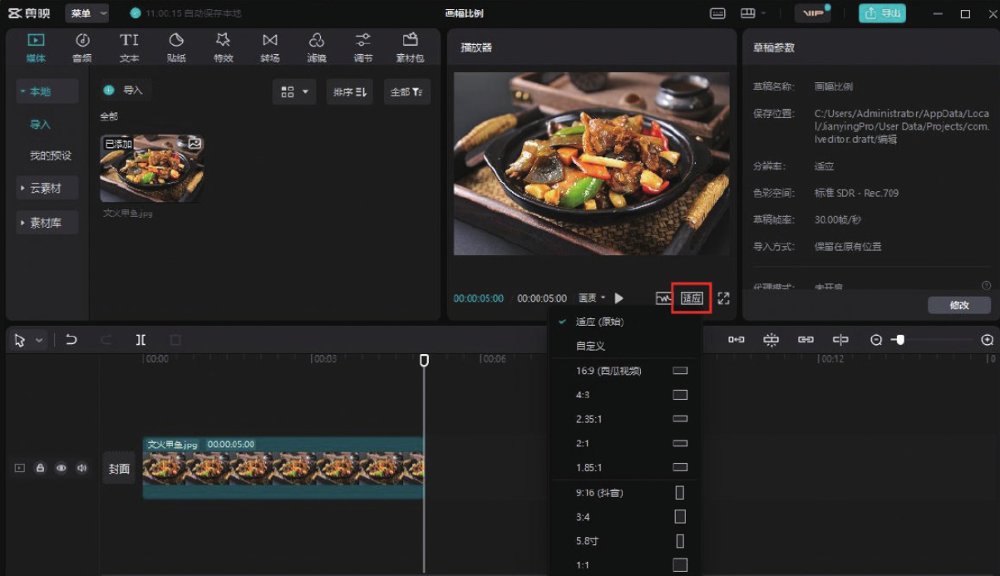
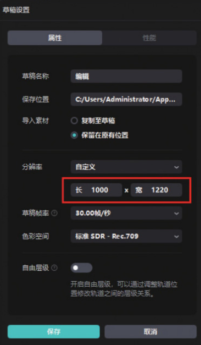
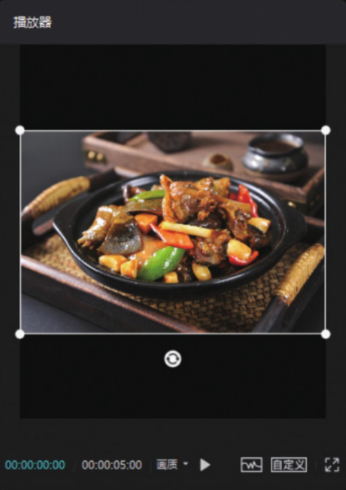

剪映专业版中调整画幅比例的功能名称与剪映 App 中不一样，用户如果想在剪映专业版中调整画幅比例，需要在预览区的右下角单击“适应”按钮，打开比例选项栏，如图 2-92 所示。在比例选项栏中选择不同的比例选项，即可在预览区看到不同的画面效果。

选择其中的“自定义”选项，即可打开“草稿设置”对话框，用户可以在对话框中根据自己的需求设置长和宽的数值，如图 2-93 所示。设置完成后，单击“保存”按钮，即可在预览区看到相应的画面效果，如图 2-94 所示。

