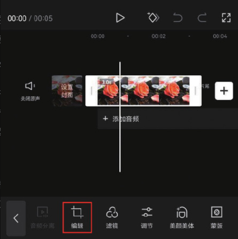
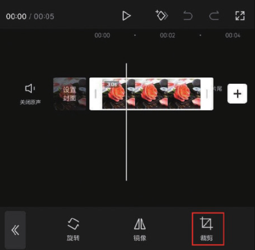
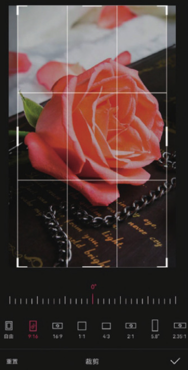
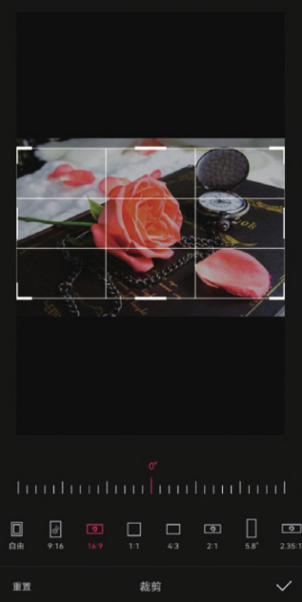
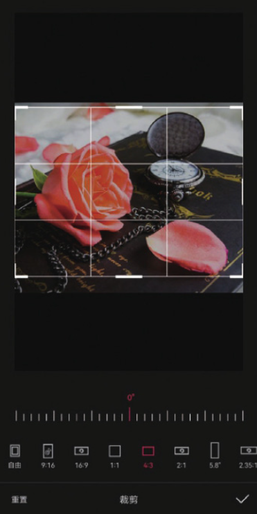
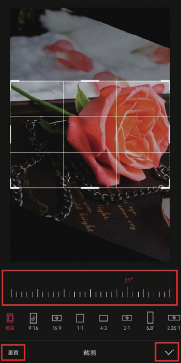
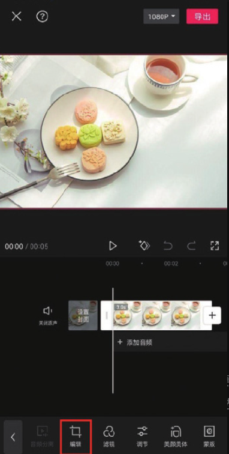
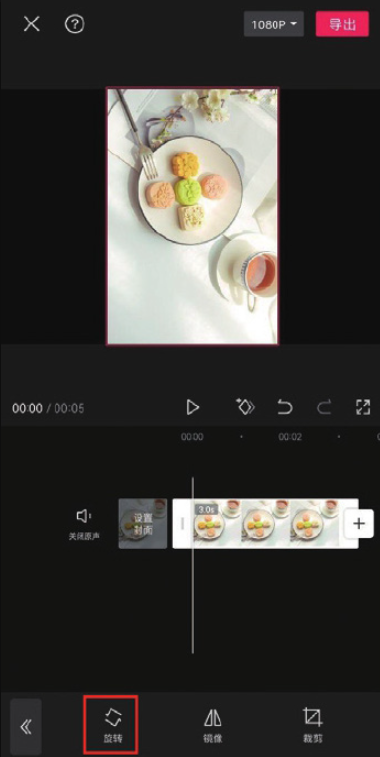
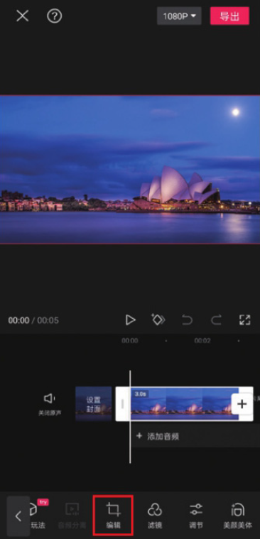
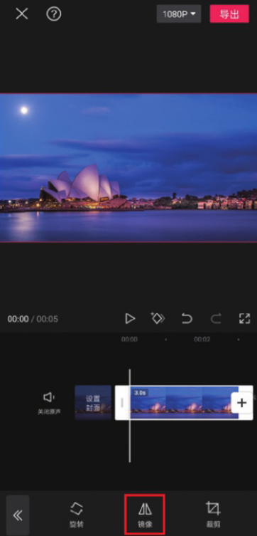

剪映的“编辑”功能对于不知道如何构图取景的用户来说是很实用的，因为在视频编辑中，合理地编辑画面可以起到“二次构图”的作用。剪映的编辑选项栏中包含“裁剪”​“旋转”​“镜像”三个选项。

## 1. 裁剪

在时间轴中选中需要裁剪的素材，然后在底部工具栏中点击“编辑”按钮，打开编辑选项栏，点击“裁剪”按钮，如图 2-95 和图 2-96 所示。




剪映的“裁剪”功能包含几种不同的裁剪模式，选择不同的裁剪比例，可以将画面裁剪出不同的效果，如图 2-97 至图 2-99 所示。






裁剪框下方分布的刻度线可以用来调整旋转角度，拖动滑块可以使画面沿顺时针或逆时针方向旋转，如图 2-100 所示。在完成画面的裁剪操作后，点击右下角的按钮可以保存画面。如果不满意裁剪效果，可点击左下角的“重置”按钮。

```
用户在进行裁剪时，可以在“自由”模式下通过拖动裁剪框的一角来将画面裁剪为任意比例大小。在其他模式下，也可以通过拖动裁剪框来改变区域的大小，但裁剪比例不会发生改变。
```

## 2. 旋转

在时间轴中选中需要旋转的素材，然后点击底部工具栏中的“编辑”按钮，接着在编辑选项栏中点击“旋转”按钮，即可对画面进行顺时针旋转，如图 2-101 和图 2-102 所示。与手动调整不同，使用“编辑”功能旋转画面不会改变画面的大小。




## 3. 镜像

剪映的“镜像”功能可以轻松地将素材画面翻转，操作方法很简单。在轨道区域选中需要翻转的素材，然后在底部工具栏中点击“编辑”按钮，接着在编辑选项栏中点击“镜像”按钮，即可将素材画面镜像翻转，如图 2-103 和图 2-104 所示。



