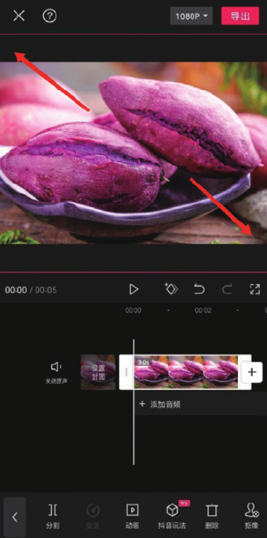
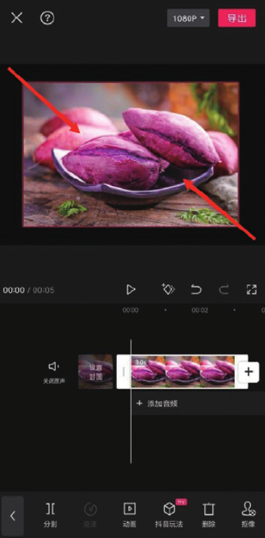
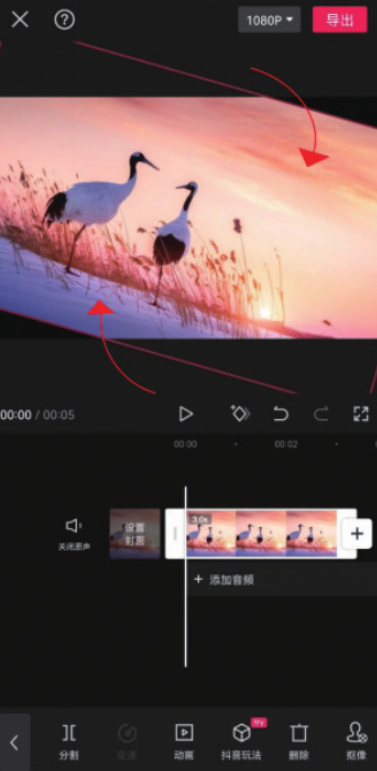
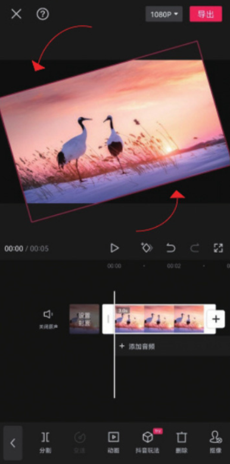

在剪映中手动调整画面很方便，用户可以自由地调整画面大小或对画面进行旋转，这种方式能有效帮助用户节省操作时间，具体操作如下。

## 1. 手动调整画面大小

在轨道区域选中需要调整的素材，然后在预览区通过开合双指来调整画面。分开双指可以将画面放大，捏合双指可以将画面缩小，如图 2-105 和图 2-106 所示。

## 2. 手动旋转视频画面

在时间轴中选中素材，然后在预览区通过旋转双指完成画面的旋转，双指的旋转方向即画面的旋转方向，如图 2-107 和图 2-108 所示。

