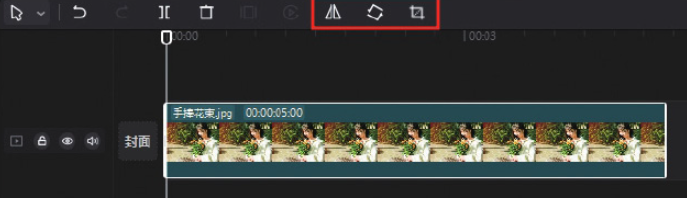
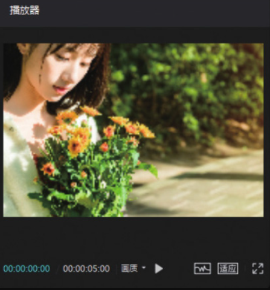
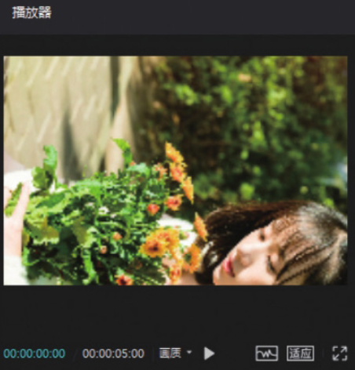
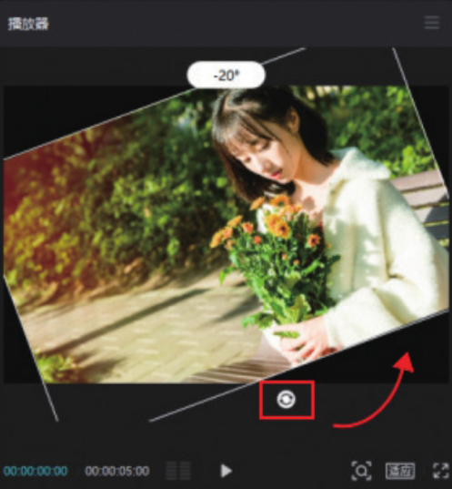
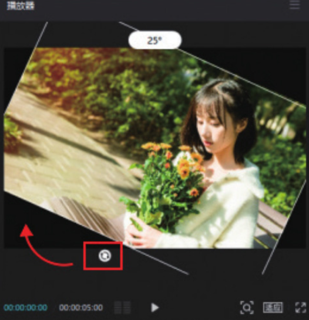
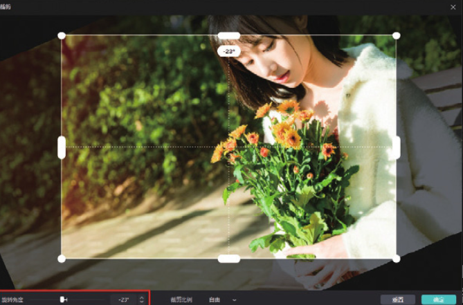
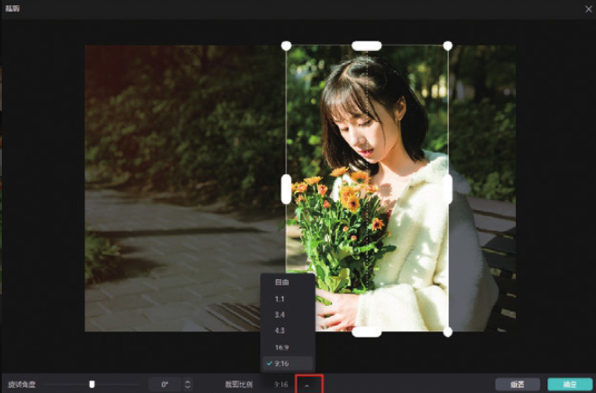

与剪映 App 不同，在剪映专业版中是无法直接找到“编辑”功能的，因为剪映专业版将“编辑”功能的三个选项（即“镜像”​“旋转”​“裁剪”​）独立出来放在了常用功能区，当用户在时间轴中选中需要编辑的素材时，即可在常用功能区找到这三个选项，如图 2-109 所示。

操作方法非常简单，当用户需要对素材进行镜像、旋转或裁剪操作时，直接在时间轴中选中素材，再在常用功能区单击相应的功能按钮即可。图 2-110 所示为单击“镜像”按钮后的画面效果，图 2-111 所示为单击“旋转”按钮后的画面效果。

需要注意的是，无论是在剪映 App 中还是在剪映专业版中，​“旋转”功能都只能沿顺时针方向对画面进行 90° 旋转。如果想对画面进行任意角度的旋转，在剪映 App 中可以选择手动旋转，而在剪映专业版中则可以通过操控按钮来旋转画面。用户只需在时间轴中选中需要旋转的素材，然后在预览区将鼠标指针置于按钮上，按住鼠标左键拖动，即可对素材进行旋转，如图 2-112 和图 2-113 所示。

当用户单击“裁剪”按钮时，界面上会弹出一个“裁剪”对话框，其底部有“旋转角度”和“裁剪比例”两个选项。用户可以通过拖动底部滑块或单击按钮对画面进行任意角度的旋转，如图 2-114 所示。

当用户单击底部的裁切按钮时，对话框中会浮现出一个裁剪比例的弹窗，选择不同的比例选项，可以裁剪出不同的画面效果，如图 2-115 所示。

