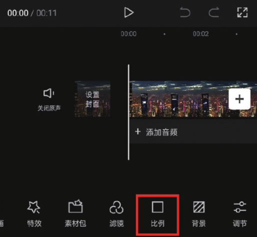
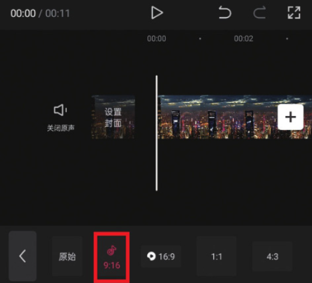
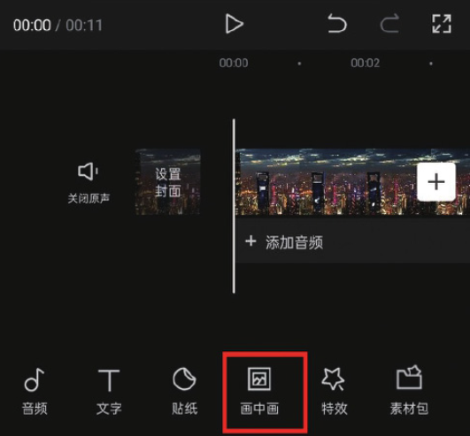
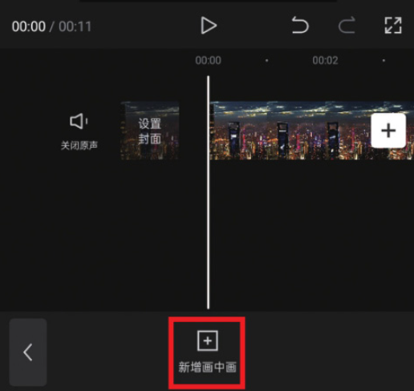
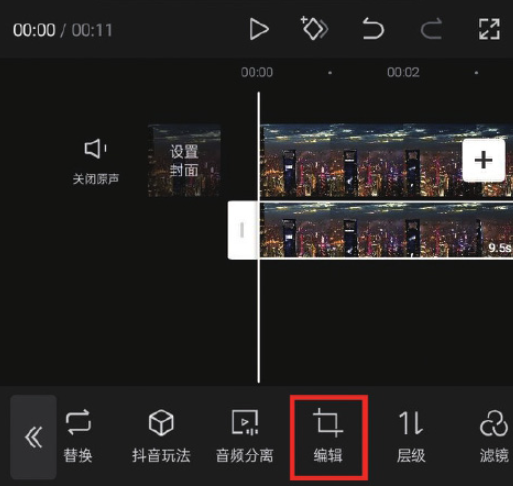
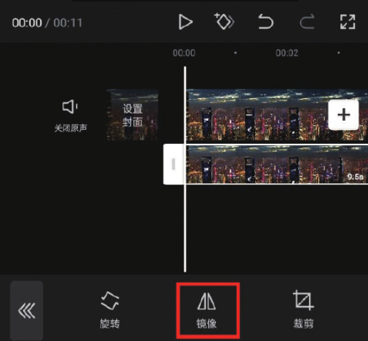
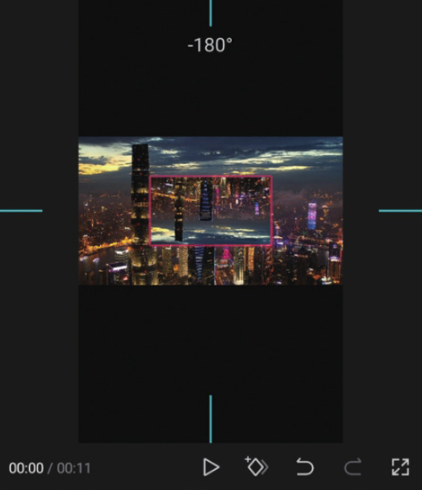
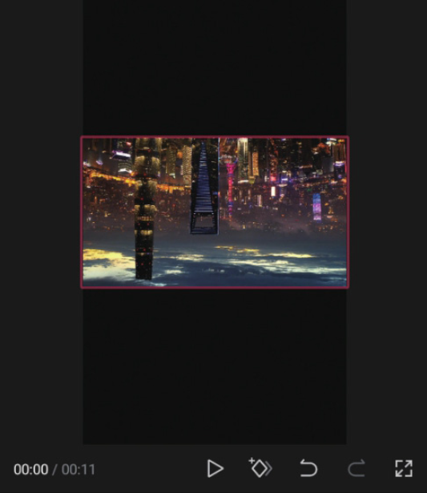
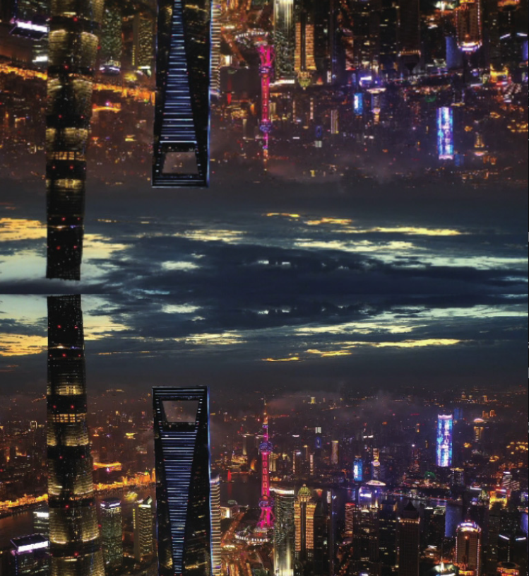

本案例介绍的是盗梦空间效果的制作方法，主要使用剪映的“比例”和“镜像”功能。下面介绍具体的操作方法。

01 打开剪映 App，在素材添加界面选择一段“城市夜景”的视频素材并将其添加至剪辑项目中，然后在底部工具栏中点击“比例”按钮，选择 9:16 的比例，如图 2-116 和图 2-117 所示。

02 点击“画中画”按钮，再点击“新增画中画”按钮，进入素材添加界面，导入同一段视频素材，如图 2-118 和图 2-119 所示。

03 在时间轴中选中画中画素材，点击“编辑”按钮，在编辑选项栏中点击“镜像”按钮，如图 2-120 和图 2-121 所示。

04 在预览区将画中画素材逆时针旋转 180°，如图 2-122 所示，然后调整好视频大小，使其与原视频重合，如图 2-123 所示。

05 在预览区将画中画素材移动至显示区域的上方，将原视频移动至显示区域的下方。

06 为视频添加一首合适的背景音乐，添加完成后点击“导出”按钮，即可将视频保存至相册，效果如图 2-124 所示。

