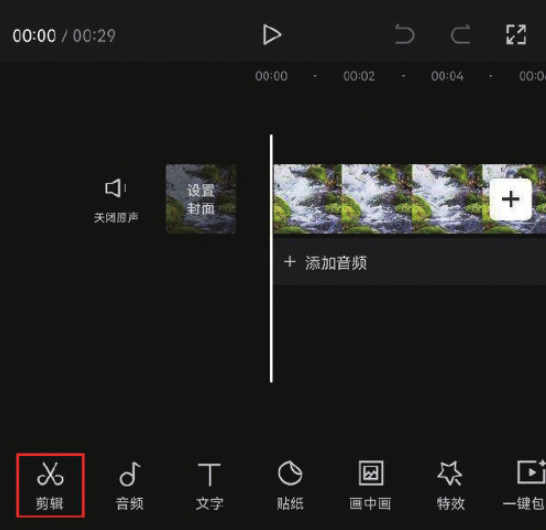
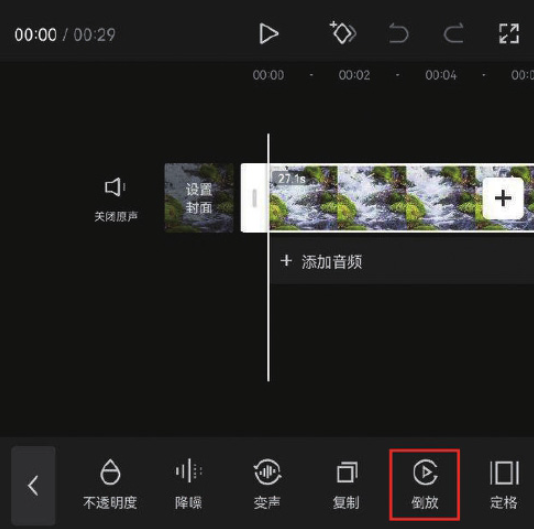

倒放效果非常常见，使用方法很简单，下面通过制作河水倒流效果来讲解“倒放”功能的使用方法。

在剪映 App 中导入一段河流的视频素材，进入视频编辑界面，点击底部工具栏中的“剪辑”按钮，如图 2-125 所示，滑动工具栏，找到并点击“倒放”按钮，如图 2-126 所示。操作完成后，在视频编辑界面点击播放按钮预览素材效果，即可看到视频以倒放的形式进行播放。




```
剪映专业版中的“倒放”功能按钮位于常用功能区，其使用方法与剪映App中“倒放”功能的使用方法一致，在时间轴中选中素材，然后单击“倒放”按钮，即可将视频倒放。
```
