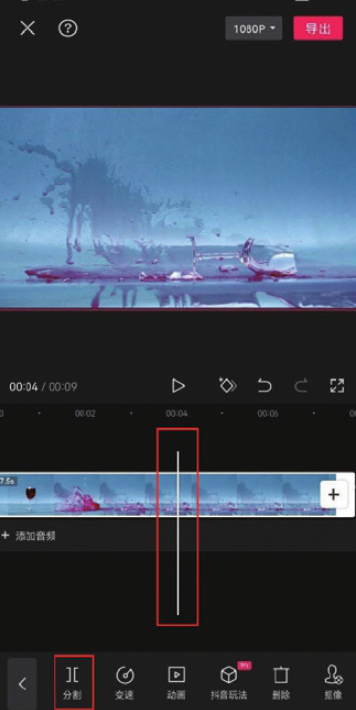
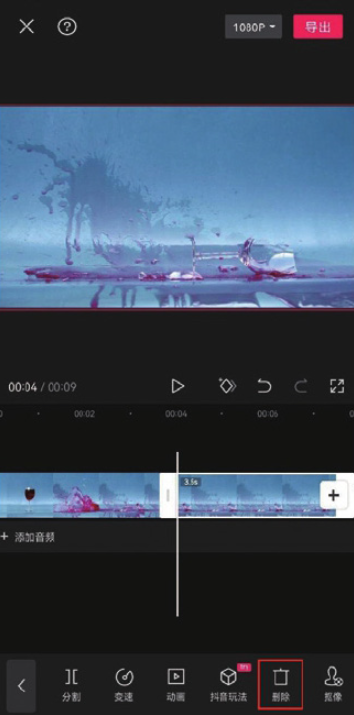
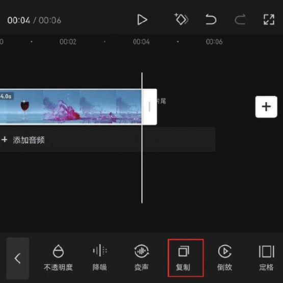
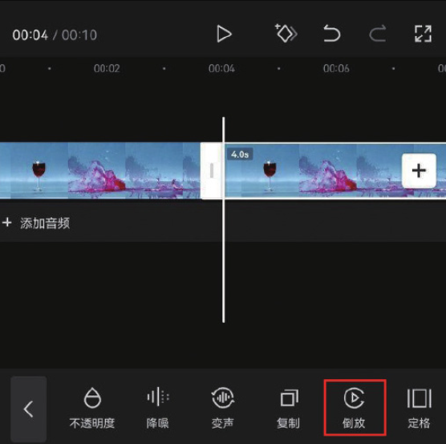

本案例介绍的是时光回溯效果的制作方法，主要使用剪映的“复制”和“倒放”功能。下面介绍具体的操作方法。

01 打开剪映 App，在素材添加界面选择一段“杯子破碎”的视频并将其添加至剪辑项目中，将时间线定位至杯子破碎的位置，选中素材，点击底部工具栏中的“分割”按钮，再点击“删除”按钮，将分割出来的后半段素材删除，如图 2-127 和图 2-128 所示。

02 将时间线定位至视频的尾端，选中素材，点击底部工具栏中的“复制”按钮，如图 2-129 所示。选中复制的素材，点击底部工具栏中的“倒放”按钮，如图 2-130 所示。

03 为视频添加一首合适的背景音乐，添加完成后即可点击“导出”按钮，将视频保存至相册，效果如图 2-131 和图 2-132 所示。
