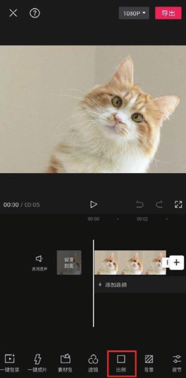
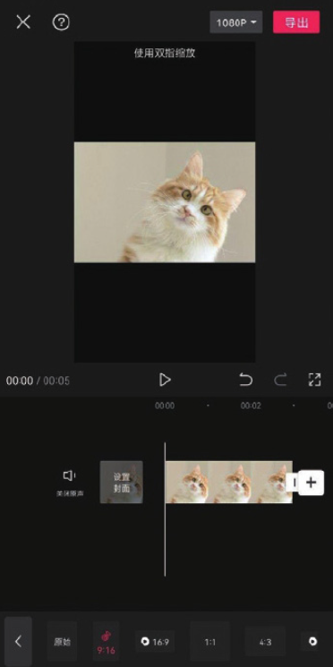
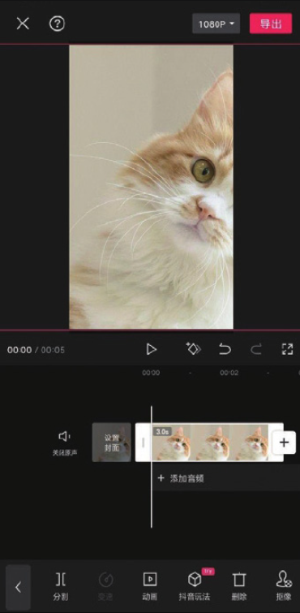
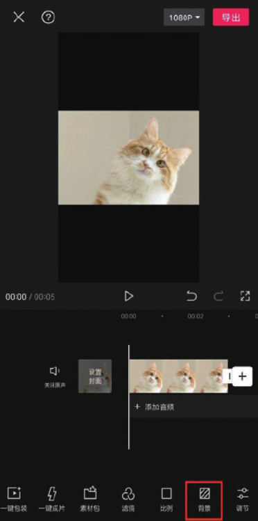
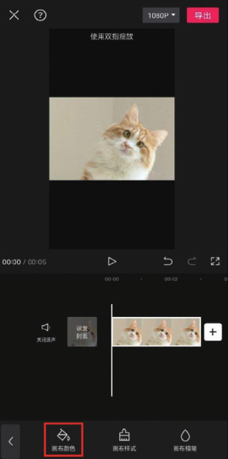
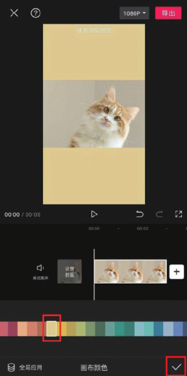

在剪辑项目中添加一个横画幅图像素材，在未选中任何素材的状态下，点击底部工具栏中的“比例”按钮，如图 2-133 所示。打开比例选项栏，选择 9:16 选项，如图 2-134 所示。




由于画面比例发生改变，因此素材画面出现了未铺满画布的情况，上下均出现黑边，这非常影响观感，若此时在预览区将素材画面放大，使其铺满画布，则会造成画面内容的缺失，如图 2-135 所示。



想在不丢失画面的前提下铺满画布，可进行如下操作。

在未选中素材的状态下，点击底部工具栏中的“背景”按钮，如图 2-136 所示。



打开背景选项栏，点击“画布颜色”按钮，如图 2-137 所示。接着在打开的“画布颜色”选项栏中点击任意一种颜色，即可将该颜色应用到画布，如图 2-138 所示，操作完成后点击右下角的按钮即可。




```
若想为画布统一设置颜色，可在选择颜色后点击“全局应用”按钮。
```
