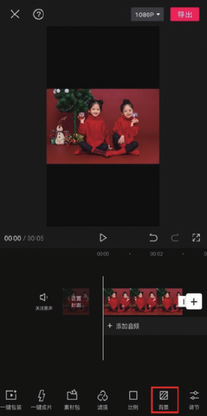
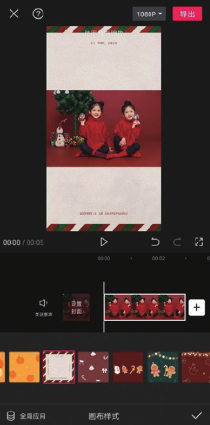

在剪映中，用户除了可以为素材设置纯色画布，还可以应用画布样式营造个性化视频效果。应用画布样式的方法很简单，在未选中素材的状态下，点击底部工具栏中的“背景”按钮，如图 2-139 所示。



接着在打开的背景选项栏中点击“画布样式”按钮，如图 2-140 所示。在打开的“画布样式”选项栏中点击任意一种样式，即可将该样式应用到画布，如图 2-141 所示。



```
若不需要应用画布样式效果，在“画布样式”选项栏中点击按钮即可。
```
