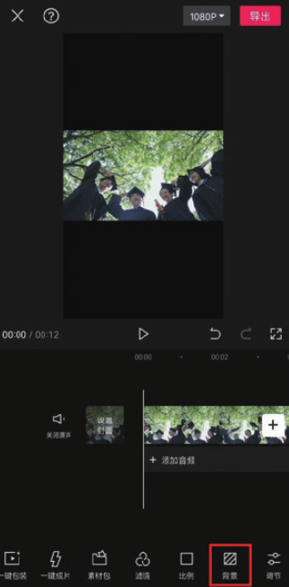
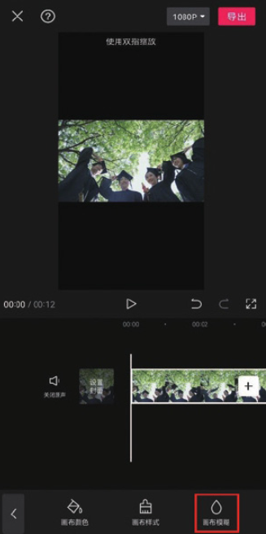
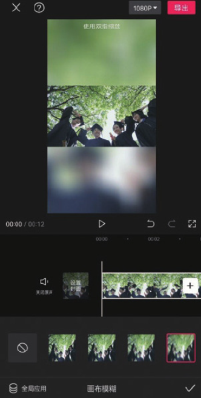

前面为大家介绍的两类画布均为静态效果画布。若用户在添加完视频素材后，想让画布背景跟随画面产生动态效果，可以设置模糊画布，以丰富画面、增强画面动感。

在剪映 App 中添加一段视频素材，在未选中任何素材的状态下，点击底部工具栏中的“背景”按钮，如图 2-142 所示。接着在打开的背景选项栏中点击“画布模糊”按钮，如图 2-143 所示。在打开的“画布模糊”选项栏中，可以看到剪映为用户提供了 4 种不同的模糊效果，点击任意一种效果，即可将其应用到项目中，如图 2-144 所示。

