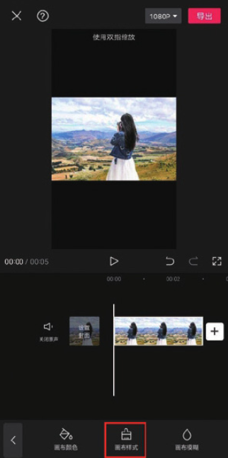
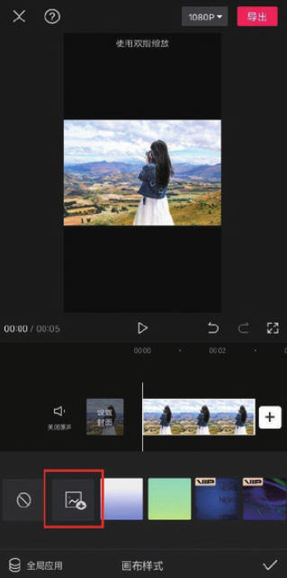
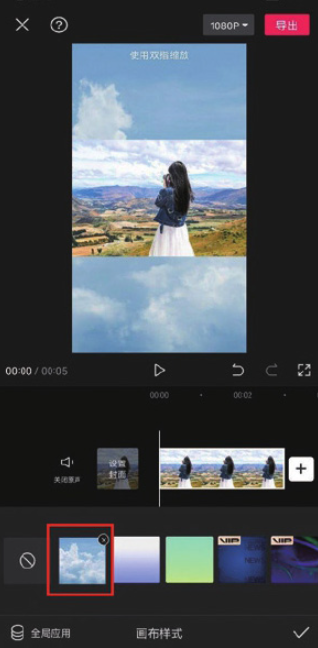

若用户对剪映内置的画布样式效果不满意，可以在本地相册中选择喜欢的素材并将其设置为背景画布。

在剪映 App 中添加一段素材，在未选中任何素材的状态下，点击底部工具栏中的“背景”按钮，接着在打开的背景选项栏中点击“画布样式”按钮，如图 2-145 所示。再在打开的“画布样式”选项栏中点击按钮，打开相册列表，选择需要的素材并将其应用到项目中即可，如图 2-146 和图 2-147 所示。

