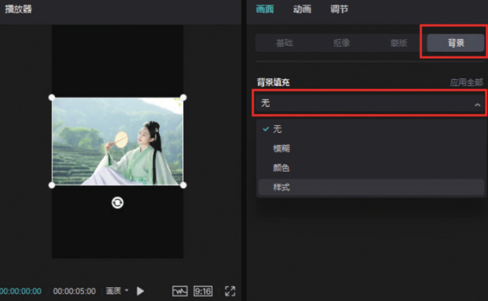
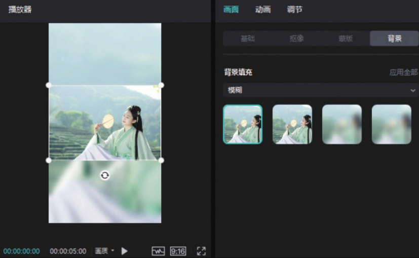
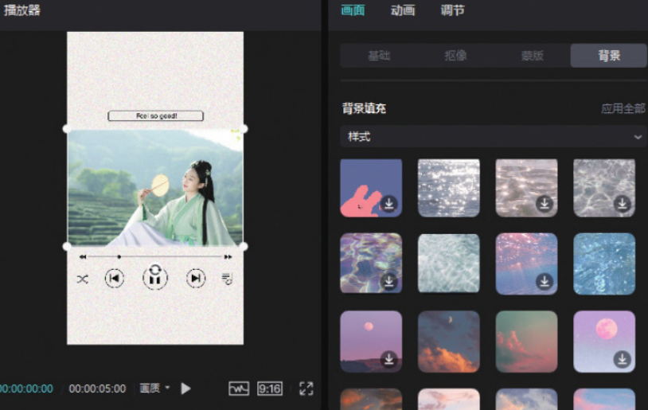
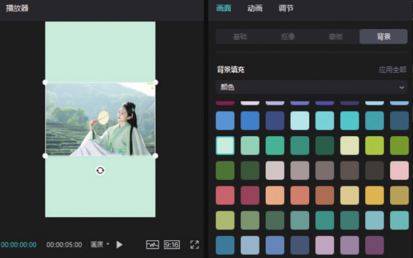

剪映专业版的“背景”功能位于素材调整区。首先在剪辑项目中添加一个横画幅图像素材，单击预览区右下角的“适应”按钮，打开比例选项栏，选择 9:16 选项。然后在时间轴中选中素材，在素材调整区单击“背景”按钮，再单击按钮，在“背景填充”下拉列表中可以看到“无”​“模糊”​“颜色”​“样式”4 个选项，如图 2-148 所示。

当用户选择“模糊”选项后，可以看到剪映为用户提供的 4 种不同的背景模糊效果，选择其中任意一种效果，即可将其应用到项目中，如图 2-149 所示。

设置背景样式或颜色的操作与上述设置背景模糊效果的操作方法一致，在“背景填充”下拉列表中选择“样式”或“颜色”选项，即可打开相应的选项栏，在选项栏中单击所需的样式或颜色的缩览图，即可将选择的效果应用到项目中。图 2-150 为应用了背景样式的效果示意图，图 2-151 为应用了背景颜色的效果示意图。

