本案例介绍的是校园写真集的制作方法，主要使用剪映的“编辑”​“背景”​“分割”​“踩点”功能。下面介绍具体的操作方法。

01 在剪映 App 中添加多张校园写真的图像素材，选中第 1 段素材，点击底部工具栏中的“编辑”按钮，打开编辑选项栏，点击“裁剪”按钮，选择 4:3 选项，点击按钮保存图像，如图 2-152 和图 2-153 所示。

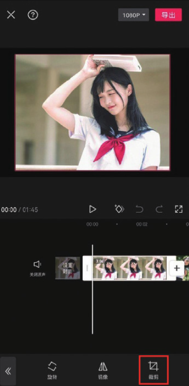
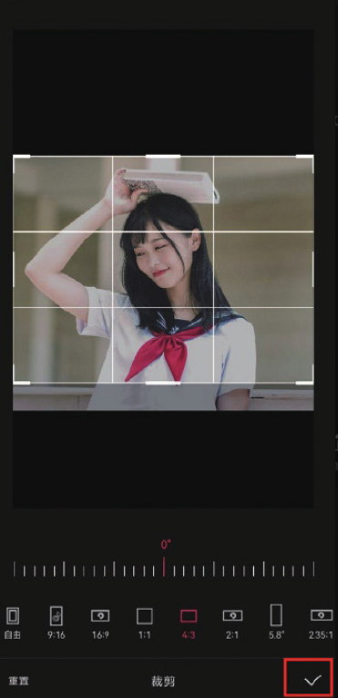

02 参照步骤 01 的操作，将余下素材统一按照 4:3 的比例进行裁剪。在未选中任何素材的状态下，点击底部工具栏中的“比例”按钮，打开比例选项栏，选择 9:16 选项，如图 2-154 和图 2-155 所示。

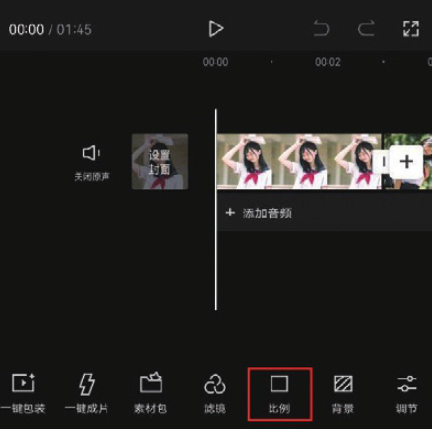
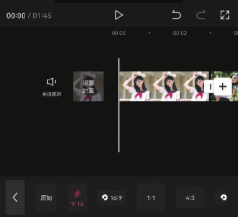

03 在未选中任何素材的状态下，点击底部工具栏中的“背景”按钮，打开背景选项栏，点击“画布模糊”按钮，如图 2-156 所示，选择其中任意一种模糊效果，点击左下角的“全局应用”按钮，并点击按钮保存，如图 2-157 所示。

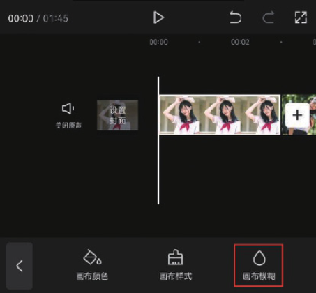
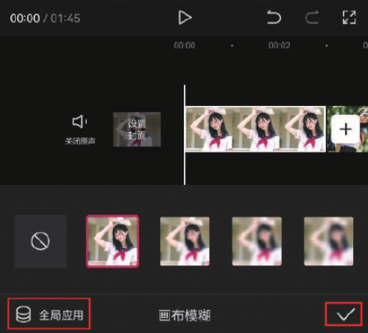

04 将时间线置于视频的起始位置，点击时间轴中的“添加音频”按钮，如图 2-158 所示，再在底部工具栏中点击“音乐”按钮，如图 2-159 所示。进入剪映音乐库，在“卡点”分类中选择图 2-160 所示的背景音乐。

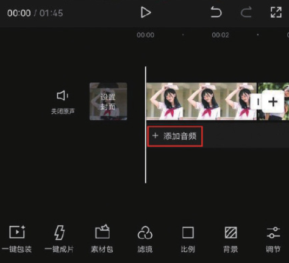
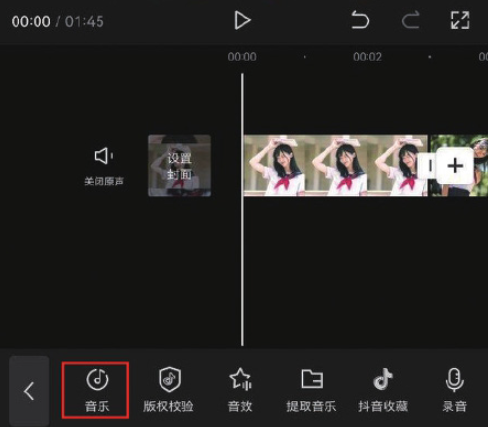
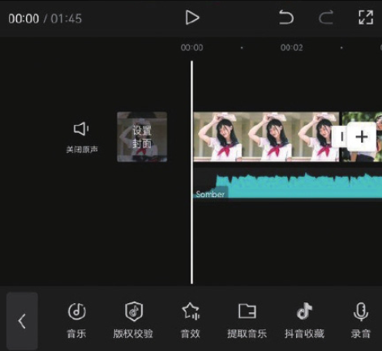

05 在时间轴中选中音乐素材，点击底部工具栏中的“踩点”按钮，如图 2-161 所示。在界面浮现的选项栏中点击“自动踩点”按钮，选择“踩节拍‖”选项，点击按钮保存，如图 2-162 所示。在时间轴中根据音频的节拍点对素材进行分割，使每段素材都置于两个节拍点中间，如图 2-163 所示。

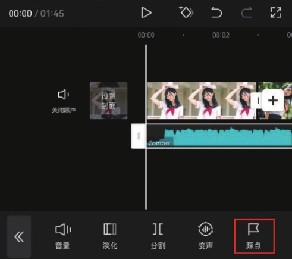
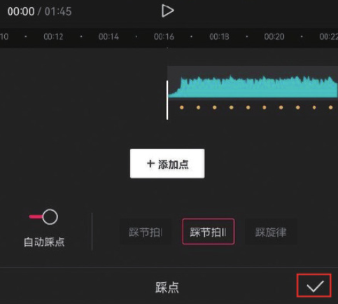
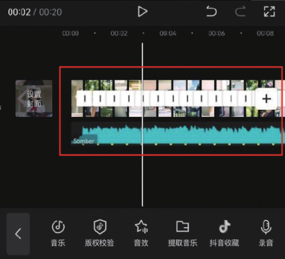

06 点击“导出”按钮，将视频保存至相册，效果如图 2-164 和图 2-165 所示。

