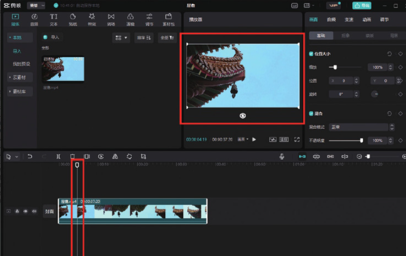
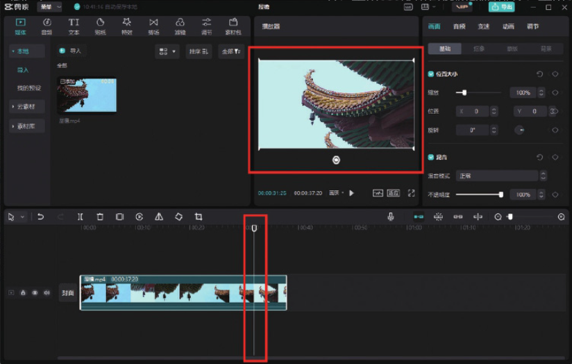
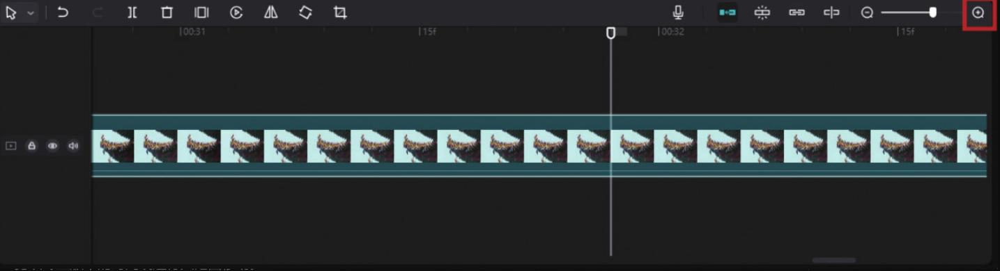
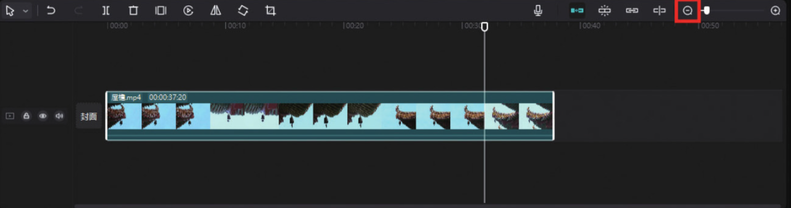

在剪映专业版中，时间线的使用逻辑和剪映 App 中是一样的，只是两者的操作方法不同。在剪映专业版中，用户需要将鼠标指针置于时间线上，然后按住鼠标左键拖动，才能对时间线进行移动。而时间线定位的时间点不同，预览区显示的画面也会不同，如图 2-7 和图 2-8 所示。

由于剪映专业版的界面较大，时间轴的面积也较大，因此，可以轻松地对剪映专业版中的时间线进行大范围移动。

另外，倘若需要在剪映专业版中将视频轨道拉长，使时间刻度以帧为单位显示，可以利用时间轴右上角的滑动条进行调节，单击增加按钮可以将轨道拉长，单击减少按钮可以将轨道缩短，如图 2-9 和图 2-10 所示。

