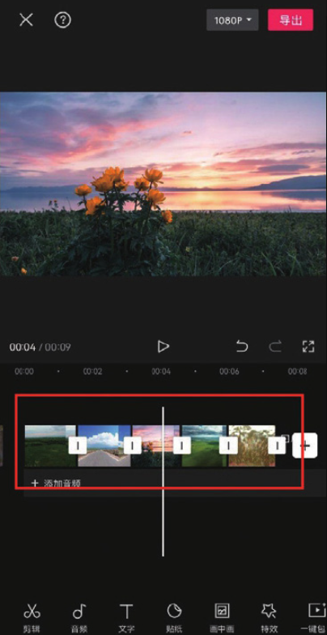
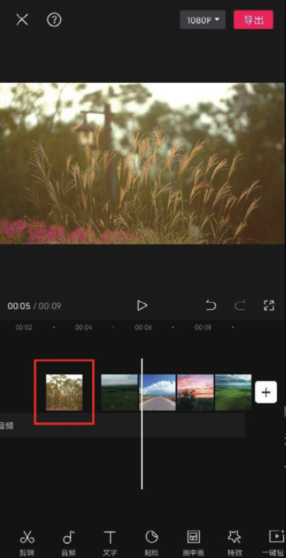
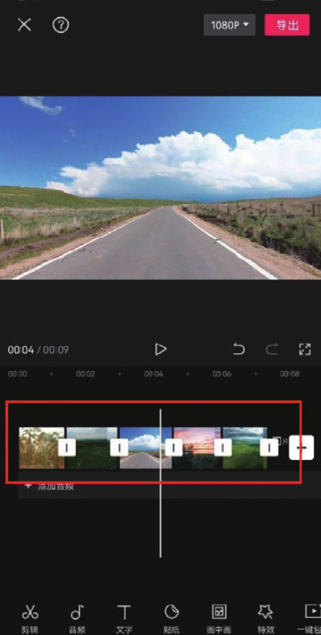
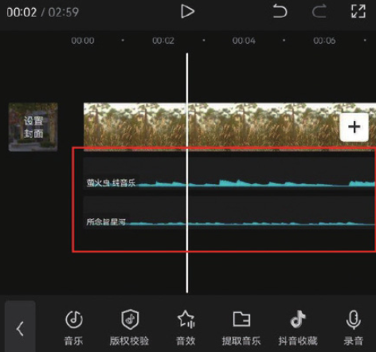
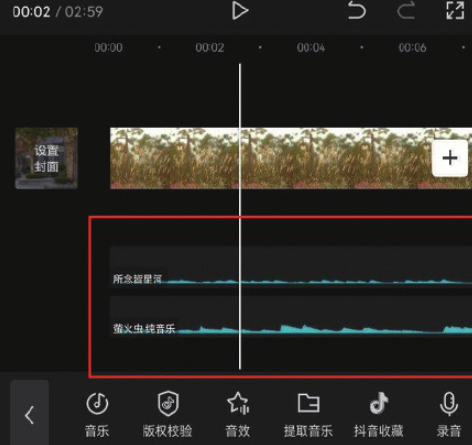

利用时间轴中的轨道可以快速调整多段视频的排列顺序，具体操作如下。

首先缩短时间轴，让每一段视频都能显示在编辑界面中，如图 2-11 所示。然后长按需要调整位置的视频片段，并将其拖曳到目标位置，如图 2-12 所示。当手指离开屏幕时，即可完成视频素材顺序的调整，如图 2-13 所示。

这种方法也可以用来调整其他轨道上素材的顺序或者改变素材所在的轨道。以图 2-14 所示的两条音频轨道为例，如果想调整两个音频轨道的顺序，可以长按第一条音频轨道，并将其移动至第二条音频轨道的下方，如

