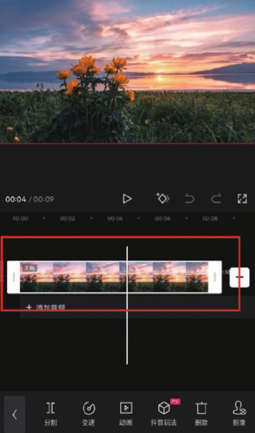
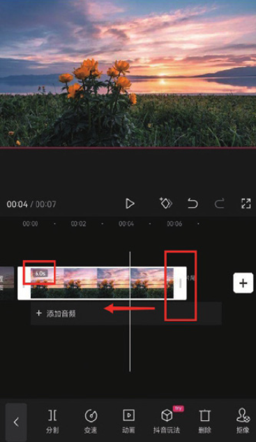
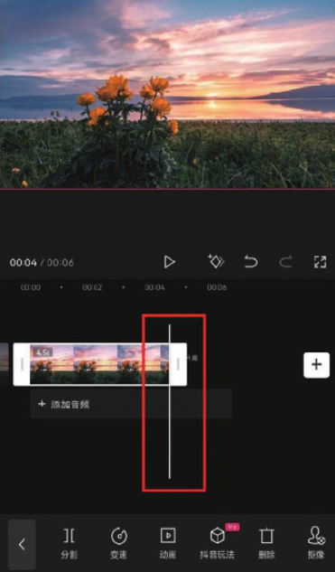

在后期剪辑时，经常会出现需要调整视频长度的情况，下面介绍快速调节的方法。

选中需要调节长度的视频片段，如图 2-16 所示。拖动左侧或右侧的白色边框，即可增加或缩短视频片段的时长。拖动时，视频片段的时长会在左上角显示，如图 2-17 所示。




当调整视频片段边框至时间线附近时，会产生吸附效果，如图 2-18 所示。可以提前确定好时间线所在的位置，以便精准地调节视频片段。



```
在剪映中调整视频片段时长时需要注意，无论是延长素材还是缩短素材都需要在有效范围内进行，延长素材时不可以超过素材本身的时间长度，也不可以过度缩短素材。
```
