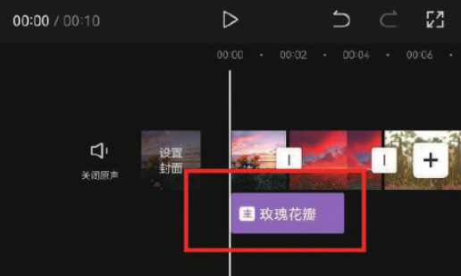
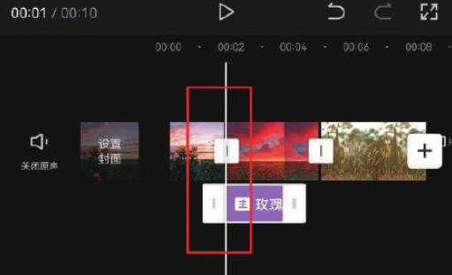
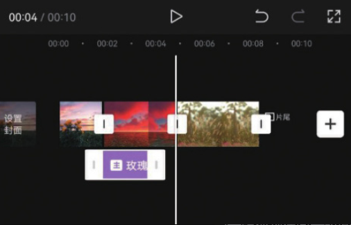
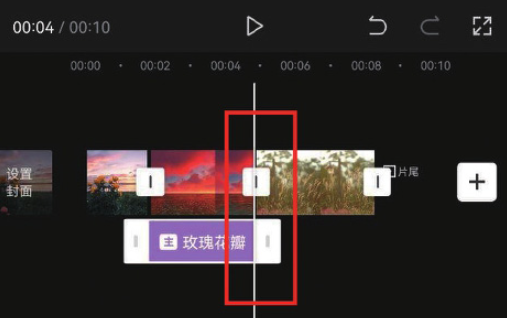

无论是添加文字，还是添加音乐、滤镜、贴纸等效果，都需要确定其覆盖范围，也就是确定从哪个画面开始，到哪个画面结束。

以图 2-19 所示的特效为例，首先移动时间线确定应用该效果的起始画面，然后点击效果片段，使其边缘出现白色边框，拖曳效果片段左侧的边框，当效果片段边框移动到时间线附近时，就会被吸附过去，自动与时间线对齐，如图 2-20 所示。

接下来移动时间线至应用该效果的结束画面，如图 2-21 所示。拖动效果片段右侧的边框部分，同样，效果片段边框被拖动至时间线附近时，就会被自动吸附过去，所以不用担心是否能对齐，如图 2-22 所示。

