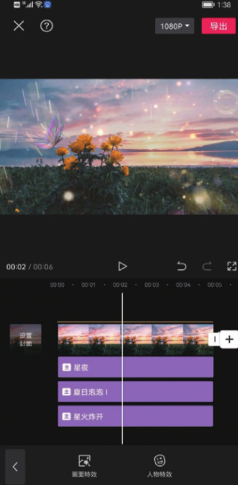

当一段视频在同一时间段内具有多个轨道时，如滤镜轨道、特效轨道、贴纸轨道等，那么在播放这段视频时，就可以同时加载覆盖这段视频的一切效果，最终呈现出丰富多彩的视频画面，如图 2-23 所示。

需要注意的是，当在同一时间点添加多种效果至不同轨道时，因为轨道的显示区域有限，所以效果轨道可能会以彩色线条的形式出现在轨道区域。例如，图 2-23 所示的贴纸效果就是以橙色线条的形式呈现的。如果需要再次选择效果轨道进行编辑，可在底部工具栏中点击相应的功能按钮。
