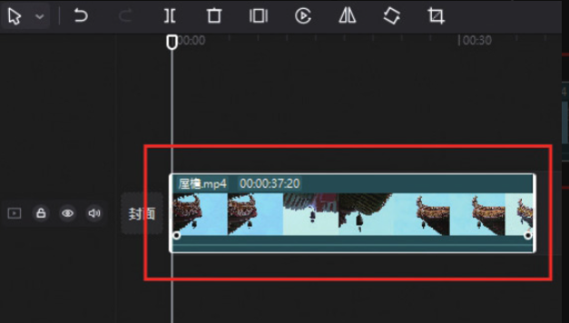
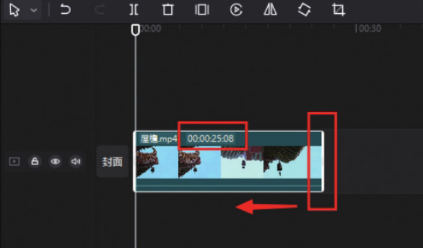
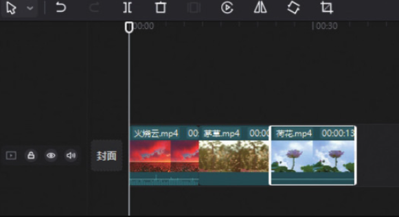
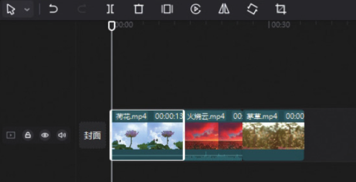

正如前面所说的，剪映专业版和剪映 App 的使用逻辑基本是一致的，只是操作方法有所不同，在轨道的编辑上也是如此。

在剪映专业版中，如果想调节视频片段的长度，需要在时间轴中选中视频片段，使其边缘出现白色边框，如图 2-24 所示，将鼠标指针置于素材的右侧边框上，按住鼠标左键，将其向左移动，即可缩短视频长度，如图 2-25 所示。同理，若将其向右移动，即可延长视频片段的长度。




如果想快速调整多段视频的排列顺序，可以直接选中需要调整位置的视频片段，如图 2-26 所示，然后按住鼠标左键拖曳，将其移动到目标位置即可，如图 2-27 所示。




```
在剪映专业版中，调整效果片段覆盖范围的操作方法与调整视频长度的方法一致，直接使用鼠标移动效果片段的边框部分即可。
```
