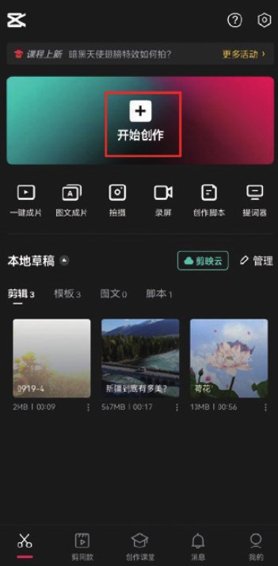
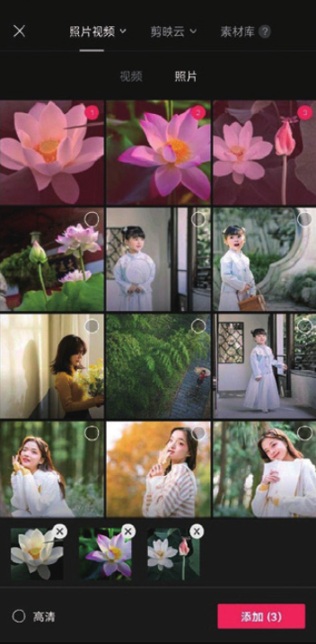
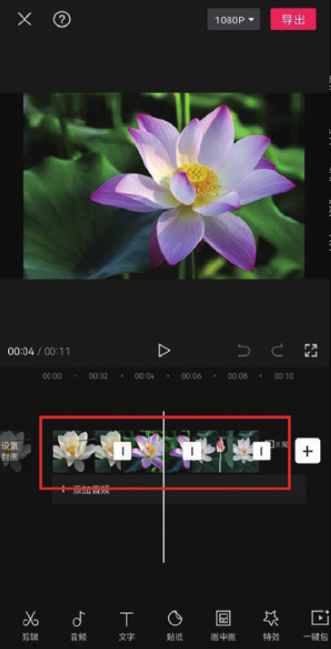
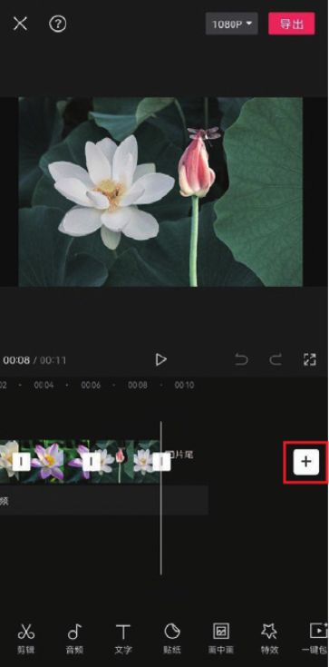
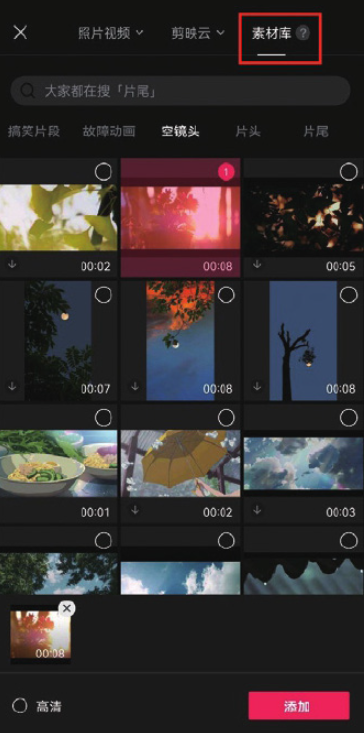
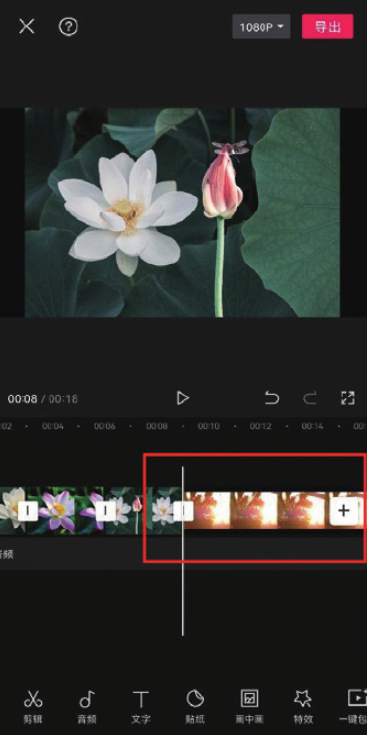

剪映 App 作为一款手机端应用，它与 PC 端常用的 Premiere、会声会影等剪辑软件有许多相似之处。例如，在素材的轨道分布上，剪映 App 同样做到了一类素材对应一个轨道。

打开剪映 App，在主界面点击“开始创作”按钮，如图 2-28 所示，打开手机相册，选择一个或多个视频或图像素材，完成选择后，点击界面底部的“添加”按钮，如图 2-29 所示。进入视频编辑界面后，可以看到选择的素材分布在同一条轨道上，如图 2-30 所示。





```
在进行素材选择时，点击素材缩览图右上角的圆圈可以选中目标；若点击素材缩览图，可以展开素材进行全屏预览。
```

在剪映 App 中，用户除了可以添加手机相册中的视频和图像素材，还可以选择剪映素材库中的视频及图像素材。

在图 2-31 所示的界面中点击时间轴中的添加按钮，在素材添加界面选择“素材库”选项，如图 2-32 所示，用户可以在素材库中选择需要使用的素材，完成选择后，点击“添加”按钮，进入视频编辑界面，可以看到所选的素材已经添加至时间轴中，如图 2-33 所示。




