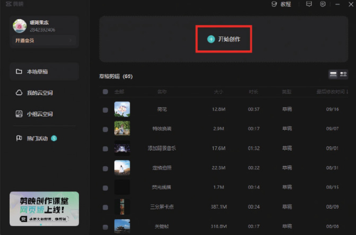
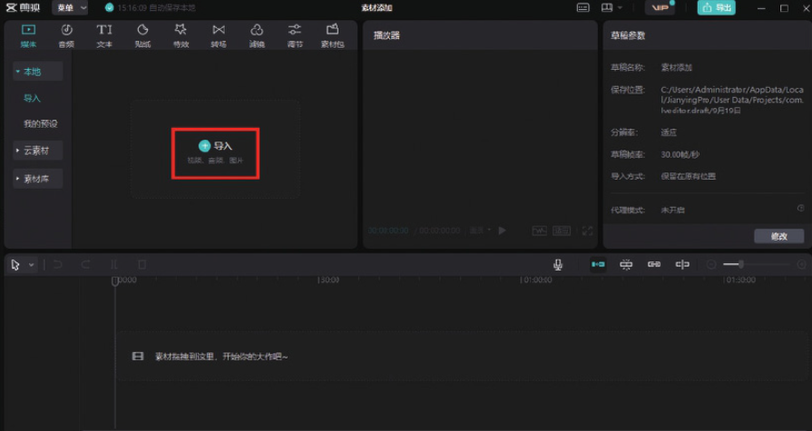
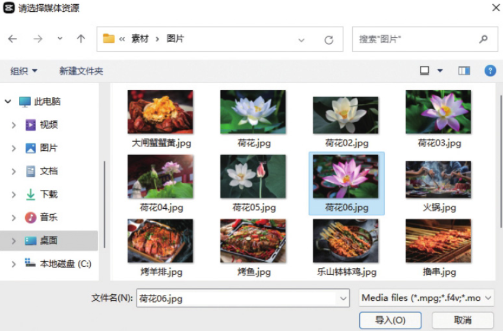
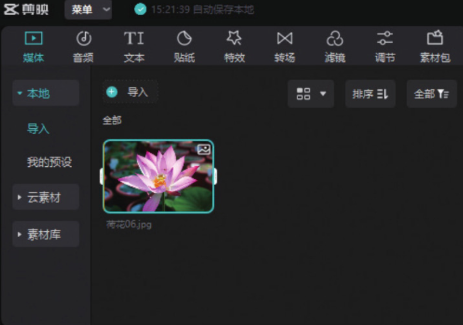

在剪映专业版中添加素材，首先需要创建一个剪辑项目，再打开素材所在的文件夹并导入素材。下面介绍具体的操作方法。

01 打开剪映专业版软件，在首页上单击“开始创作”按钮，如图 2-34 所示。



02 进入视频编辑界面，此时已经创建了一个视频剪辑项目，单击“导入”按钮，如图 2-35 所示。



03 在打开的“请选择媒体资源”对话框中打开素材所在的文件夹，选择需要使用的图像或视频素材，选择完成后单击“导入”按钮，如图 2-36 所示。



完成上述操作后，选择的素材将导入剪映专业版的本地素材库中，如图 2-37 所示，用户可以随时调用素材进行编辑处理。



04 将本地素材库中的图片素材拖入时间轴中，如图 2-38 所示，这样就完成了素材的调用。

```
若需要添加素材库和素材包中的素材，可以直接单击“素材库”或“素材包”按钮，在其选项栏中选择需要添加的素材，按照上述操作方法将素材拖入时间轴中即可。
```
