本案例介绍的是美食混剪短视频的制作方法，主要使用剪映的“素材库”和“素材包”功能。下面介绍具体的操作方法。

01 打开剪映 App，在主界面点击“开始创作”按钮，打开手机相册，在该界面上选择 8 张美食图像素材，完成选择后，点击界面底部的“添加”按钮，如图 2-39 和图 2-40 所示。

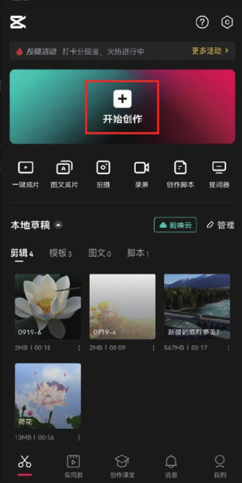
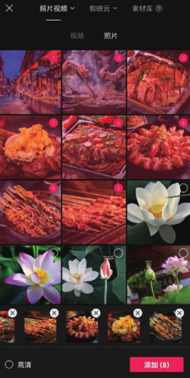

02 进入视频编辑界面，选中第 1 段素材，将时间线定位至 00:01 处，将图像素材右侧的白色边框向左拖动，使素材的时长缩短至 1s，如图 2-41 和图 2-42 所示。

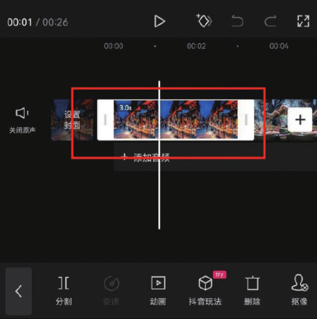
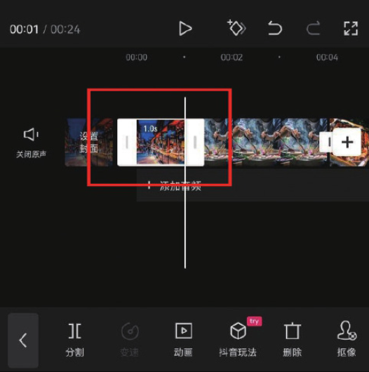

03 参照步骤 02 的操作方法，将余下 7 段素材的时长都调整为 1s。将时间线定位至视频的起始位置，点击底部工具栏中的“素材包”按钮，如图 2-43 所示，在“片头”选项中选择图 2-44 所示的视频片段，然后点击界面右上角的按钮。

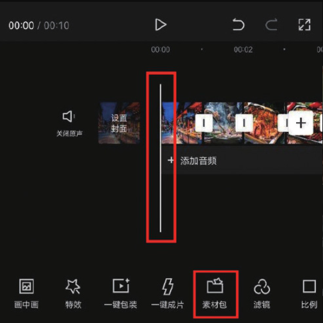
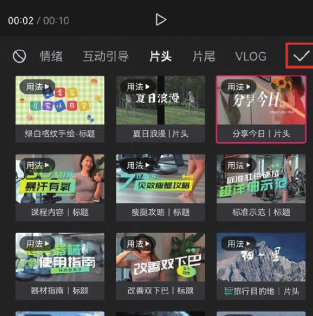

04 在时间轴中选中片头素材，将其右侧的白色边框向左拖动，使片头素材的长度与第 1 段素材的长度保持一致，如图 2-45 所示。将时间线定位至视频的结尾处，点击界面右侧的添加按钮，如图 2-46 所示。

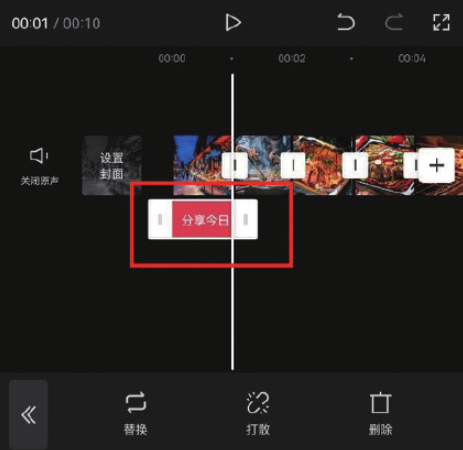
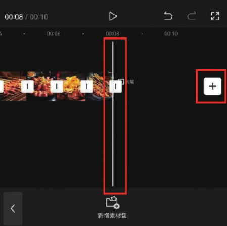

05 在素材添加界面选择“素材库”选项，在“片尾”选项中选择图 2-47 所示的素材，完成选择后，点击“添加”按钮，进入视频编辑界面，可以看到所选的素材已经添加至时间轴中，如图 2-48 所示。

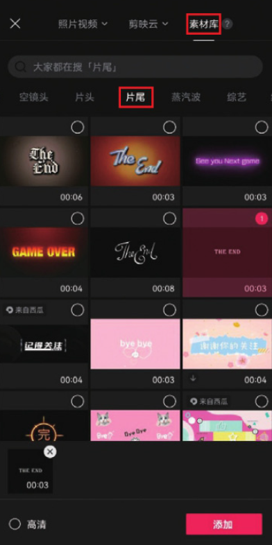
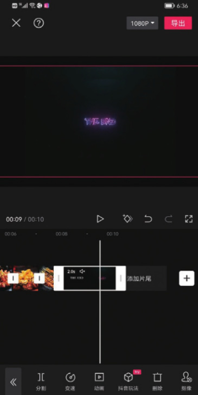

06 为视频添加一首合适的背景音乐，添加完成后点击“导出”按钮，即可将视频保存至相册，效果如图 2-49 和图 2-50 所示。

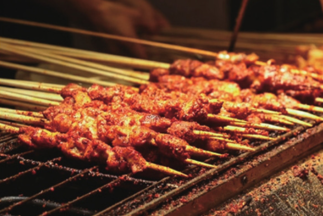
