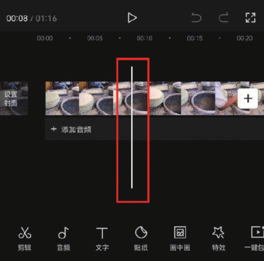
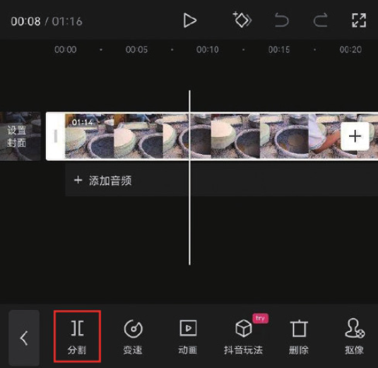
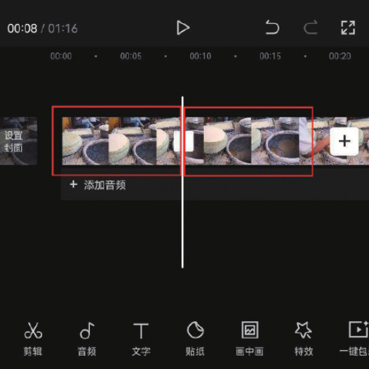
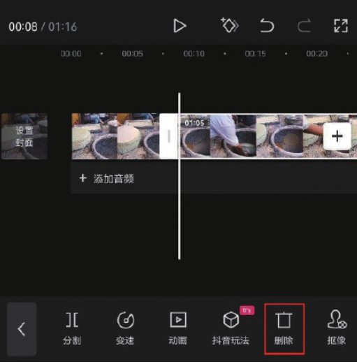
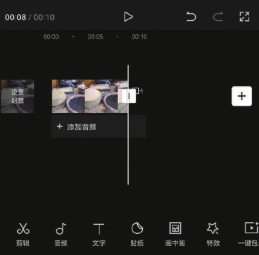

在导入一段素材后，往往需要截取出需要的部分，当然，选中视频片段，然后拖动白色边框同样可以达到截取片段的目的，但在实际操作过程中，该方法的精准度不是很高，因此，如果需要精准截取片段，最好的办法就是使用“分割”功能。

在剪映 App 中使用“分割”功能的方法很简单，首先将时间线定位至需要进行分割的时间点，如图 2-51 所示，接着选中需要进行分割的素材，在底部工具栏中点击“分割”按钮，即可将选中的素材在时间线所在位置一分为二，如图 2-52 和图 2-53 所示。

在时间线区域选中分割出来的后半段素材，在底部工具栏中点击“删除”按钮，即可将选中的素材片段删除，如图 2-54 和图 2-55 所示。

