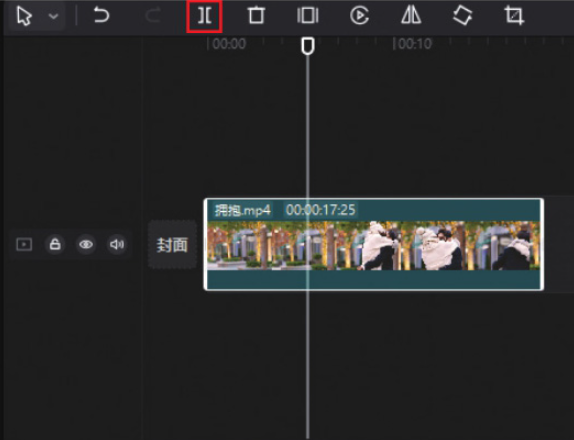
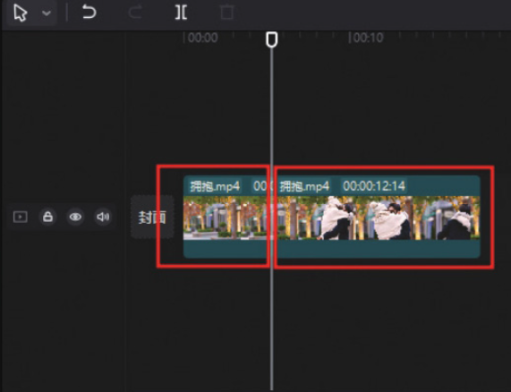
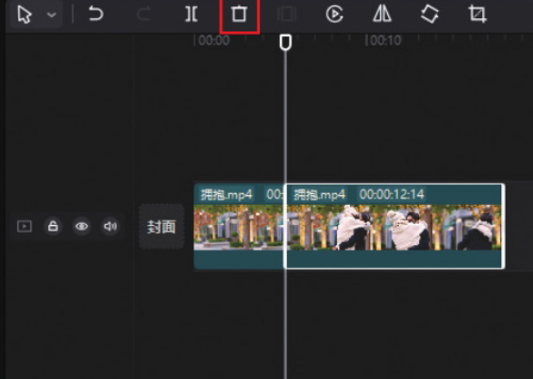
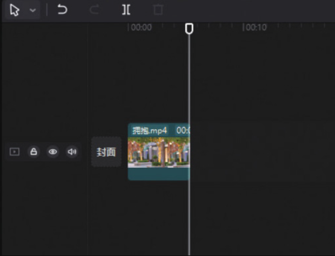

在剪映专业版中，当用户需要对素材进行分割时，首先要在时间轴中选中素材，然后将时间线定位至需要进行分割的时间点，在常用功能区单击“分割”按钮，即可将素材一分为二，如图 2-59 和图 2-60 所示。




分割后选中分割出来的后半段素材，在常用功能区单击“删除”按钮，即可将选中的素材片段删除，如图 2-61 和图 2-62 所示。




```
一段原本5秒的视频被分割截取成2秒后，选中该段2秒的视频，并拖动其白色边框，依然能够将其恢复成5秒的视频。因此，分割并删除无用的片段后，那部分片段并不会彻底“消失”​。所以用户在操作时需要格外小心，因为如果不小心拖动了被分割视频的白色边框，被删除的部分就会重新出现。如果没有及时发现，很有可能会影响接下来的一系列操作。
```
