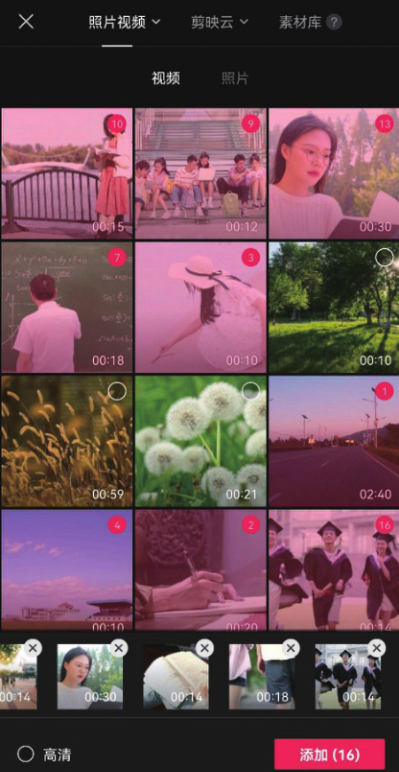
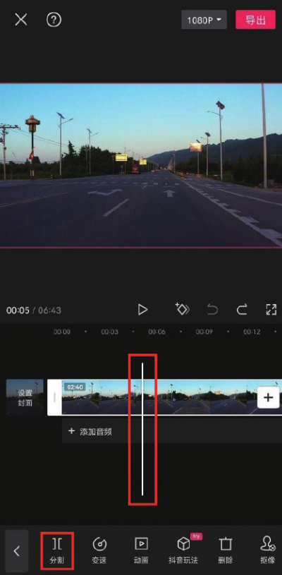
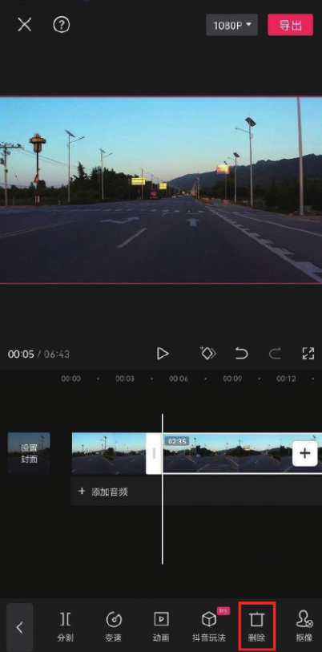
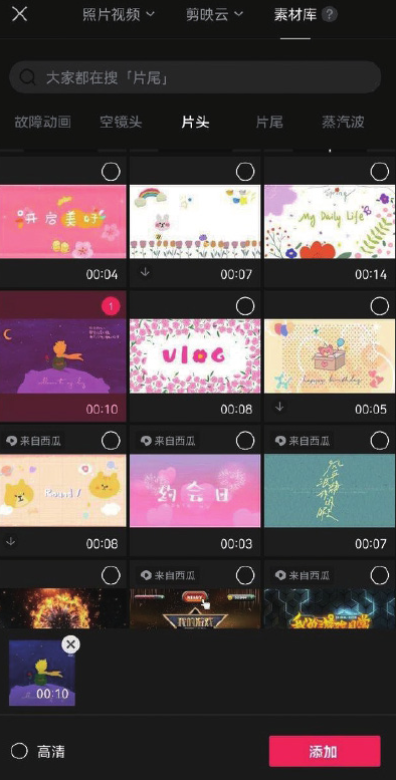
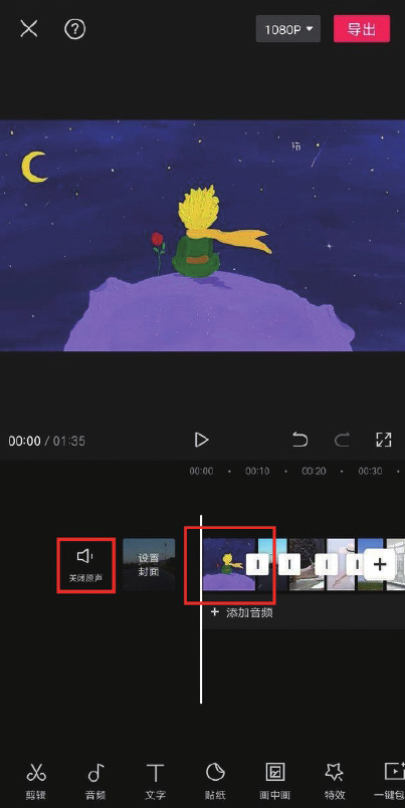
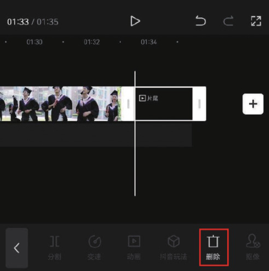
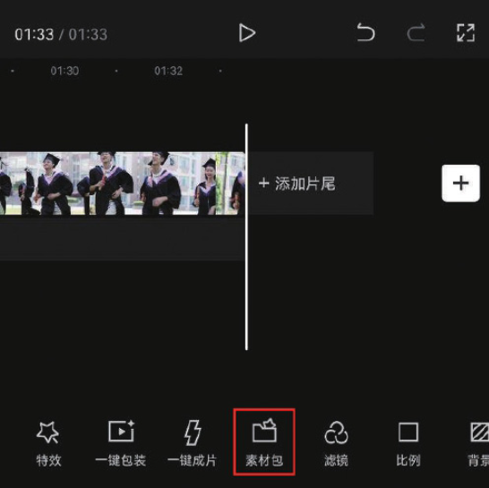
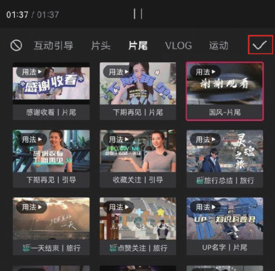
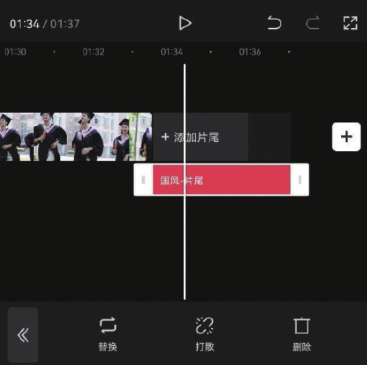
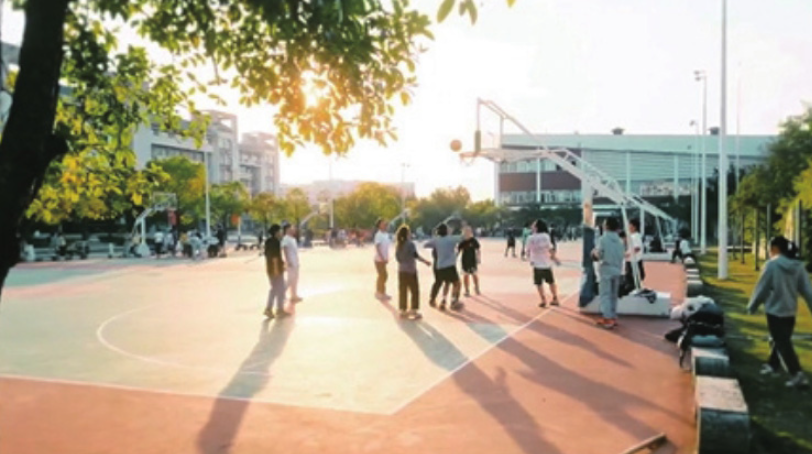

本案例介绍的是《校园回忆》短视频的制作方法，主要使用剪映的“分割”和“删除”功能。下面介绍具体的操作方法。

01 打开剪映 App，导入 16 段关于校园生活的视频素材，如图 2-63 所示，将时间线移动至 00:05 的位置，选中第 1 段素材，点击底部工具栏中的“分割”按钮，选中后半段素材，点击“删除”按钮，将后半段素材删除，如图 2-64 和图 2-65 所示。

02 参照步骤 01 的操作方法，将余下的视频素材分割，并删除多余的片段。将时间线定位至视频的起始位置，点击界面右侧的“添加”按钮，如图 2-66 所示，在素材添加界面选择“素材库”选项，在“片头”选项中选择图 2-67 所示的素材，完成选择后，点击“添加”按钮，进入视频编辑界面，点击“关闭原声”按钮，如图 2-68 所示。

03 将时间线移动至视频的结尾处，选中片尾，点击底部工具栏中的“删除”按钮，如图 2-69 所示，将剪映自带的片尾删除，再点击底部工具栏中的“素材包”按钮，如图 2-70 所示。

04 打开素材包选项栏，在“片尾”选项中选择图 2-71 所示的视频片段，点击界面右上角的确认按钮，即可为视频更换一个新的片尾，如图 2-72 所示。

05 为视频添加一首合适的背景音乐，添加完成后点击“导出”按钮，即可将视频保存至相册，效果如图 2-73 和图 2-74 所示。

