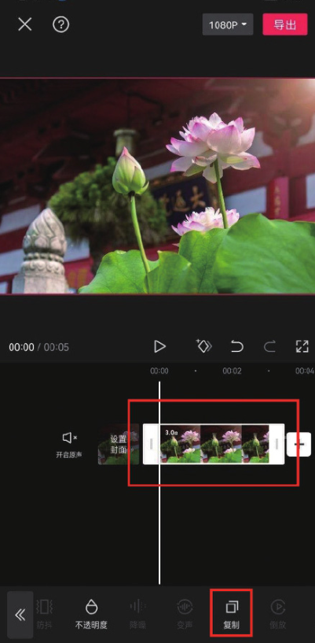
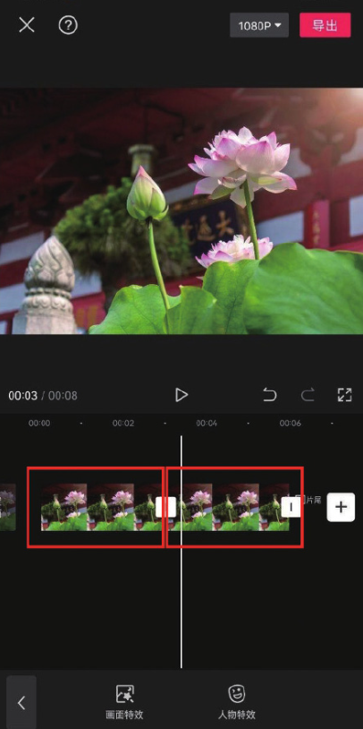
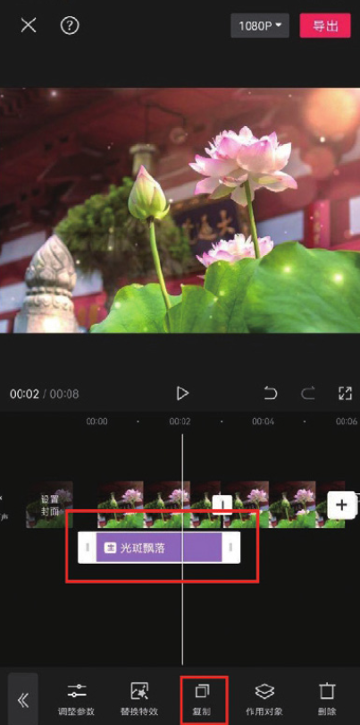
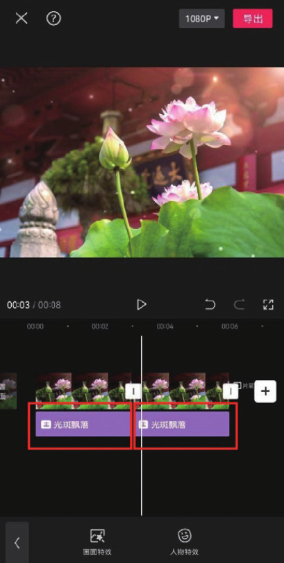

在视频编辑过程中，如果需要多次使用同一个素材，重复导入素材是一件比较麻烦的事情，而使用“复制”功能添加素材可以有效地节省工作时间。

在项目中导入一段素材，并使该素材处于选中状态，点击底部工具栏中的“复制”按钮，即可在时间轴中复制出一段同样的素材，如图 2-75 和图 2-76 所示。

剪映的“复制”功能不仅可以复制素材，还可以复制特效、滤镜、贴纸等效果，操作方法与复制素材的方法一致。以图 2-77 所示的特效为例，在时间轴中选中该特效，点击底部工具栏中的“复制”按钮，即可在时间轴中复制出一段同样的特效，如图 2-78 所示。

