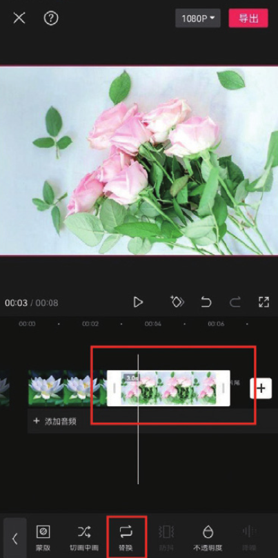
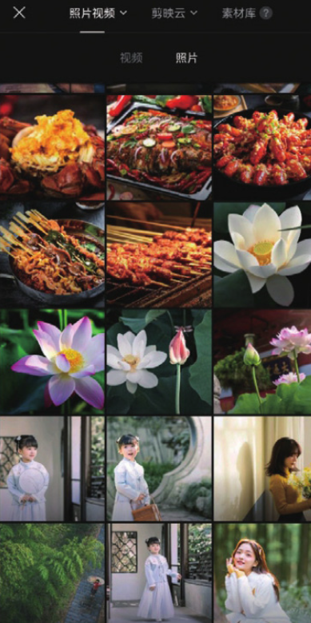
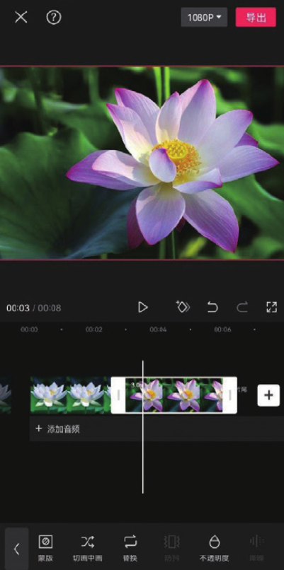

替换素材是视频剪辑中的一项必备技能，它能够帮助用户打造出更符合心意的作品。在进行视频编辑处理时，如果用户对某部分的画面效果不满意，直接删除该素材可能会对整个剪辑项目产生影响。为了在不影响剪辑项目的前提下更换不满意的素材，可以使用剪映的“替换”功能。

在时间轴中选中需要替换的素材片段，在底部工具栏中点击“替换”按钮，如图 2-79 所示。接着进入素材选取界面，点击用于替换的素材，即可完成替换，如图 2-80 和图 2-81 所示。





```
如果用于替换的素材未能铺满画布，可以选中素材，然后在预览区通过捏合双指来调整画面大小。值得注意的是，如果替换的是视频素材，那么所选择的新素材的时长不能短于被替换素材的时长。
```
